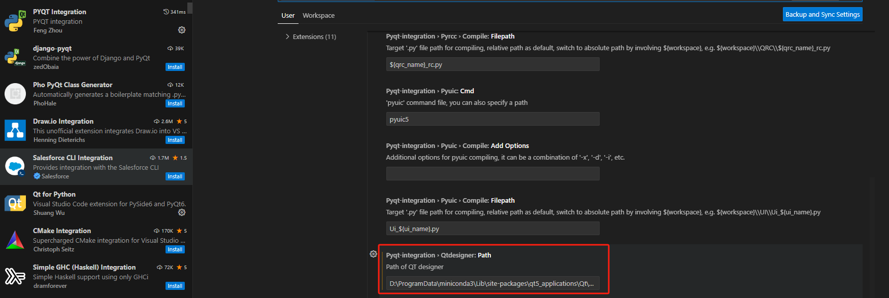

### 界面开发选型
一般使用PyQt开发界面,通常会配合 Qt Designer 进行界面设计,在开始前我们选择使用PyQt6版本.所以确保我们安装了PyQt6版本
```bash
pip install pyqt6
```


如果是PyQt5,由于我这边配合`VsCode`进行开发,推荐安装`PYQT Integration`插件,安装后需要做相应的配置,需要告知`PYQT Integration` Qt Designer所在的地址  
```bash
# 获取Qt Designer安装路径
pip show qt5_applications
```



或者也可以直接使用命令行启动,在Window下,Qt Designer 安装完成后,使用
```bash
designer
```
命令可以启动界面设计器

> PyQt5 目前发现版本有问题 `pip install pyqt5==5.15.4` 发现会报`ModuleNotFoundError: No module named 'PyQt5.sip'`

### 使用virtualenv进行环境隔离
```bash
pip install virtualenv
```
运行以下命令来创建一个新的虚拟环境
```bash
# 比如这里创建了venv目录
virtualenv venv 
```
需要特别注意的是 `virtualenv` 创建的虚拟环境一般不提交Git进行版本管理,所以`.gitignore`最好加上以下过滤
```bash
# Virtualenv
venv/
.venv/
env/
ENV/
```
### 依赖管理
虽然我们不提交`venv`目录,但是为了方便管理依赖,我们还是使用`requirements.txt`进行依赖管理
```bash
pip freeze > requirements.txt
```

然后就可以启动虚拟环境了
```bash
# 启动虚拟环境MacOS/Linux
source venv/bin/activate
# 启动虚拟环境Windows
venv\Scripts\activate
```

### 关于打包
首先我们使用`pyinstaller`进行打包,需要安装`pyinstaller`
```bash
pip install pyinstaller
# 或者尝试升级到最新版本
pip3 install --upgrade PyInstaller pyinstaller-hooks-contrib
```

### Spec 文件
PyInstaller 首次打包后会生成一个 spec 文件,这个文件是用来描述如何打包的.通常也应该纳入版本管理.
该文件包含PyInstaller用于打包应用程序.spec的构建配置和说明。每个PyInstaller项目都有一个文件，
该文件是根据您在运行时传递的命令行选项生成的。
```python
pyinstaller main.spec
```
我们可以使用以上命令重复之前的构建过程
1. 给我们的应用程序取个好听的名字
```python
pyinstaller -n "BigRocket" main.py
# or
pyinstaller --name "BigRocket" main.py
```
以上我们生成的exe文件就会被命名为`BigRocket.exe`,同时我们的spec文件也会被命名为`BigRocket.spec`(新增)

### EXE运行时不要显示控制台
PyInstaller 默认情况下会生成一个控制台窗口,我们可以通过以下命令来修改
```python
pyinstaller -w main.py
# or
pyinstaller --windowed main.py
# or
pyinstaller --noconsole main.py
```
或者直接修改spec文件
```python
exe = EXE(
    pyz,
    a.scripts,
    [],
    exclude_binaries=True,
    name='main',
    debug=False,
    bootloader_ignore_signals=False,
    strip=False,
    upx=True,
    console=True,
    disable_windowed_traceback=False,
    argv_emulation=False,
    target_arch=None,
    codesign_identity=None,
    entitlements_file=None,
)
```
把这里的`console=True`改为`console=False`就可以

### 添加个图标或许会更好看
在`main.py`同级目录下创建一个`logo.ico`图标文件,然后使用以下命令打包
```bash
# 使用命令
pyinstaller --windowed --icon=logo.ico main.py

```


> 这里有个小插曲,我使用`PyInstaller`打包出来的exe文件提示`ModuleNotFoundError: No module named 'PyQt6'`.看起来像是依赖包没有成功引入.然后找到了这个
[打包程序后运行程序出现 ModuleNotFoundError: No module named 'PySide6'](https://blog.csdn.net/u012790503/article/details/127943395),根据这篇文章的观点

果然,在虚拟环境下安装`PyInstaller`后,再次打包成功(这里我没有卸载全局的`PyInstaller`)


### 参考链接
1. [pyqt6教程](https://zetcode.com/pyqt6/introduction/)
2. [pyqt6-tutorial](https://www.pythonguis.com/pyqt6-tutorial/)