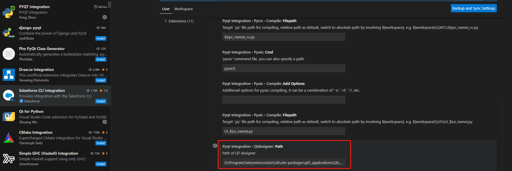
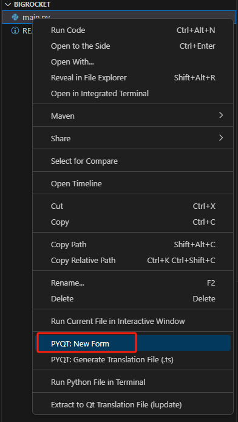

### 界面开发选型
一般使用PyQt开发界面,通常会配合 Qt Designer 进行界面设计,

由于我这边配合`VsCode`进行开发,推荐安装`PYQT Integration`插件,安装后需要做相应的配置,需要告知`PYQT Integration` Qt Designer所在的地址  
```bash
# 获取Qt Designer安装路径
pip show qt5_applications
```




或者也可以直接使用命令行启动,在Window下,Qt Designer 安装完成后,使用
```bash
designer
```
命令可以启动界面设计器