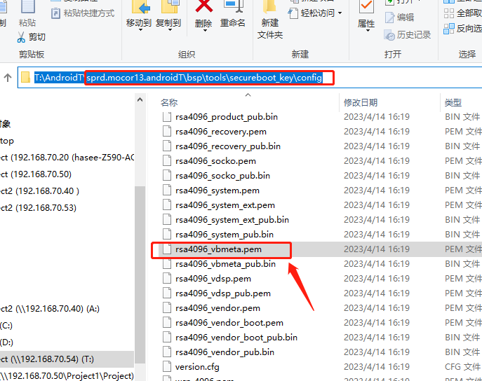
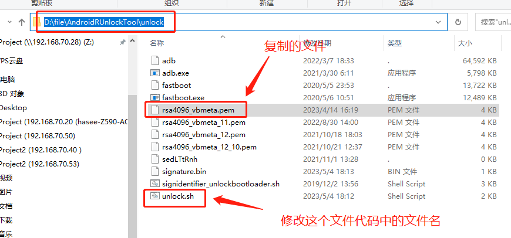
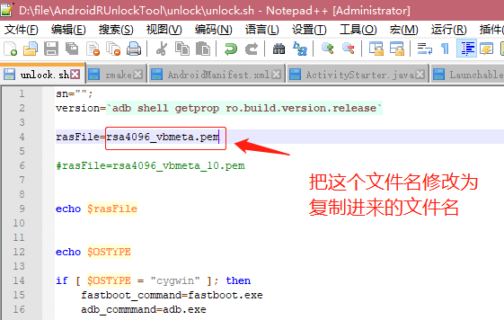
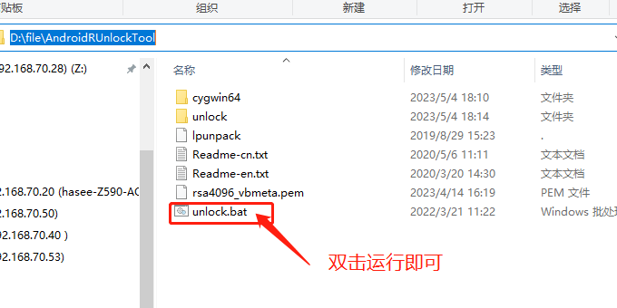
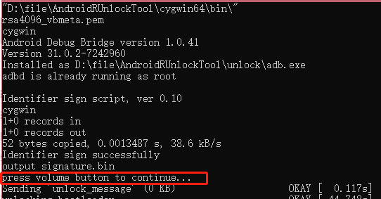
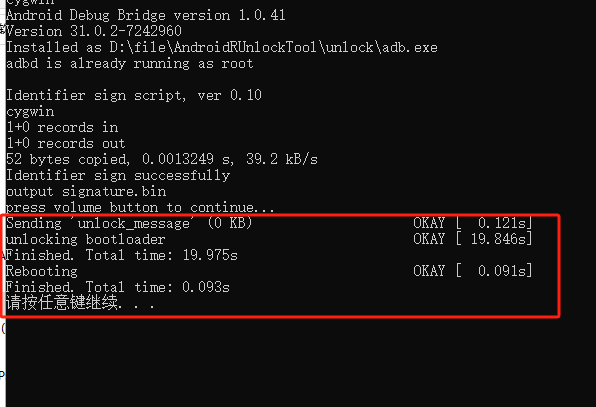

#### 解锁展锐项目
[展锐解锁工具](https://github.com/MeDeity/AndroidFrameworkTools/tree/master/SprdUnlock)放在Github上,下载后解压，里面有解锁脚本和解锁工具

找到项目中的  /bsp/tools/secureboot_key/config/目录下的rsa4096_vbmeta.pem文件

复制到AndroidRUnlockTool的unlock目录下

将unlock.sh文件中 "rasFile=XXXX" 替换成复制进来的文件名。

最后，双击运行unlock.bat即可（这一步手机不需要关机）

出现这个时根据手机提示，按手机音量键，+或者-，进行操作

即可解锁成功
