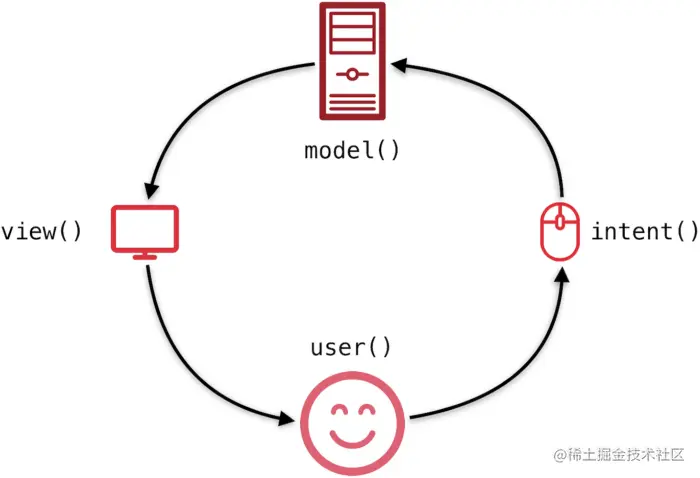

### MVI架构
`MVI`架构更加强调数据的单向流动和唯一数据源

> 图片来自[wanandroid-compose](https://github.com/RicardoJiang/wanandroid-compose)项目

图示讲解:
1. model: 单一数据源，通常是一个封装了数据的类或对象。
2. view: 视图层，负责展示数据。view 通过订阅 model的数据变化实现界面刷新
3. intent: 用户操作，例如点击按钮、滑动等。会被包装成一个事件，传递给ViewModel进行数据请求

### 订阅监听model数据变化
在MVI架构中，通常会使用MutableStateFlow来管理状态并将其转换为StateFlow对外暴露，然后在Activity或Fragment中使用observe（或collect）来监听状态的变化
>`StateFlow`是`MutableStateFlow`的只读版本，对外暴露给UI层（如Activity或Fragment）使用。UI层只能订阅状态的变化，而不能直接修改状态。这样设计的目的是
`MutableStateFlow`允许我们在架构的内部（如ViewModel）自由地修改状态,通过将MutableStateFlow转换为StateFlow对外暴露，我们确保了外部观察者无法直接修改状态，只能被动地接收状态变化，这符合不可变性的设计原则，有助于避免状态管理中的潜在问题

### 参考链接
1. [wanandroid-compose](https://github.com/RicardoJiang/wanandroid-compose)
