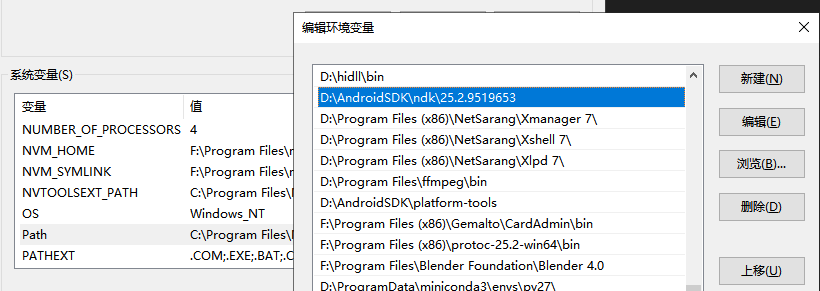
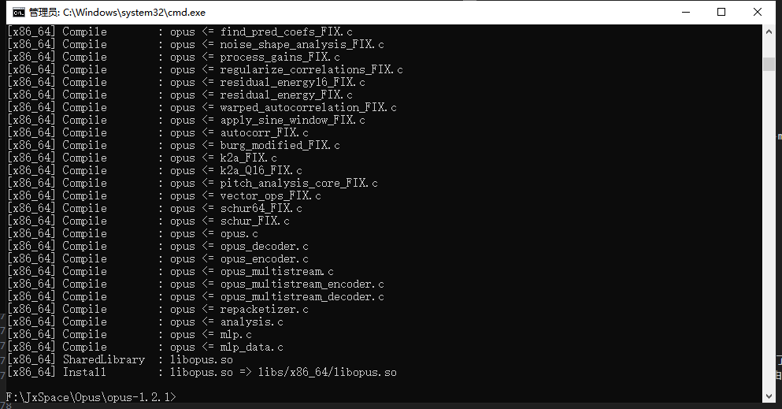
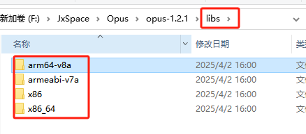
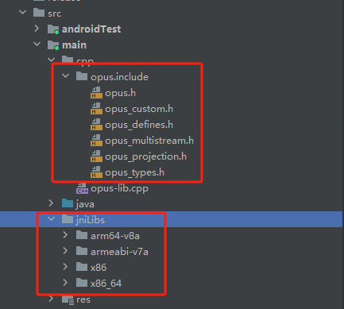

### Opus音频编解码器简介
Opus是一种开源的音频编解码器，由Xiph.Org Foundation开发,在其使用上没有任何专利或限制。它旨在提供高质量、低延迟的语音和音乐编码能力，同时保持较低的比特率。Opus支持多种采样率和通道数，非常适合实时通信应用（如VoIP）以及流媒体, 音频录制和播放。

### 在Android项目中集成Opus

#### 下载Opus库

要在Android项目中集成Opus，首先需要将Opus库文件（通常是.so文件）添加到你的项目中。你可以从[opus官网](https://www.opus-codec.org/)下载预编译的库，或者自己构建它们。
这里我们尝试自己构建自己的库。你可以在[release](https://opus-codec.org/news/)查找到所有的版本.

#### 使用NDK构建Opus
将下载后的`opus-x.x.x.tar.gz`解压,并编写Android.mk文件到opus-x.x.x文件夹内
```makefile
# LOCAL_PATH 设置为当前目录的路径，my-dir 是一个宏，它返回包含 Android.mk 文件的目录路径。
LOCAL_PATH := $(call my-dir)

# CLEAR_VARS 是一个特殊的变量，它指向一个脚本，该脚本会清除除 LOCAL_PATH 之外的所有 LOCAL_XXX 变量。这是必要的，因为在一个单一的 Makefile 中可能会多次包含不同的模块定义
include $(CLEAR_VARS)
# APP_ABI 指定要为哪些 CPU 架构编译代码。这里指定了四种架构：armeabi-v7a, arm64-v8a, x86, 和 x86_64
APP_ABI := armeabi-v7a arm64-v8a x86 x86_64
# APP_CPPFLAGS 添加了 C++11 标准的支持
APP_CPPFLAGS += -std=c++11
# APP_STL 指定使用 GNUSTL 标准库的共享版本
APP_STL := gnustl_shared
# APP_PLATFORM 指定最低 API 级别为 Android 4.1（API 16）
APP_PLATFORM := android-16

# 包含其他 Makefile 文件，这些文件定义了源文件列表，这些源文件将用于构建最终的库
include $(LOCAL_PATH)/celt_sources.mk
include $(LOCAL_PATH)/silk_sources.mk
include $(LOCAL_PATH)/opus_sources.mk
# LOCAL_MODULE 定义了模块的名称，这里设置为 opus。这将是生成的共享库的名称，例如 libopus.so。
LOCAL_MODULE        := opus

# Fixed point sources
SILK_SOURCES        += $(SILK_SOURCES_FIXED)

# 这里添加了特定架构的源文件到 SILK_SOURCES 和 CELT_SOURCES 变量，并将所有源文件列表赋值给 LOCAL_SRC_FILES
CELT_SOURCES        += $(CELT_SOURCES_ARM)
SILK_SOURCES        += $(SILK_SOURCES_ARM)
LOCAL_SRC_FILES     := \
    $(CELT_SOURCES) $(SILK_SOURCES) $(OPUS_SOURCES) $(OPUS_SOURCES_FLOAT)
# LOCAL_LDLIBS 指定链接时需要链接的系统库，这里指定了数学库（-lm）和日志库（-llog）
LOCAL_LDLIBS        := -lm -llog
# LOCAL_C_INCLUDES 指定编译时需要包含的头文件目录
LOCAL_C_INCLUDES    := \
    $(LOCAL_PATH)/include \
    $(LOCAL_PATH)/silk \
    $(LOCAL_PATH)/silk/fixed \
    $(LOCAL_PATH)/celt
# LOCAL_CFLAGS 和 LOCAL_CPPFLAGS 分别指定了编译 C 和 C++ 文件时需要添加的编译器标志
LOCAL_CFLAGS        := -DNULL=0 -DSOCKLEN_T=socklen_t -DLOCALE_NOT_USED -D_LARGEFILE_SOURCE=1 -D_FILE_OFFSET_BITS=64
LOCAL_CFLAGS        += -Drestrict='' -D__EMX__ -DOPUS_BUILD -DFIXED_POINT -DUSE_ALLOCA -DHAVE_LRINT -DHAVE_LRINTF -O3 -fno-math-errno
LOCAL_CPPFLAGS      := -DBSD=1 
LOCAL_CPPFLAGS      += -ffast-math -O3 -funroll-loops
# BUILD_SHARED_LIBRARY 是一个宏，它告诉 NDK 构建脚本生成一个共享库（.so 文件）。这行代码放在文件的最后，标志着模块定义的结束
include $(BUILD_SHARED_LIBRARY)
```
请确保本地有NDK环境,如果没有的话先安装NDK环境,并配置到PATH环境变量中


在cmd中进入到`opus-x.x.x`文件夹目录并执行命令
```bash
编译
$ cd opus-x.x.x
$ [android-sdk-windows\ndk-bundle\]ndk-build APP_BUILD_SCRIPT=Android.mk NDK_PROJECT_PATH=.
```
APP_BUILD_SCRIPT=Android.mk：这是一个环境变量，用于指定构建脚本的位置。在这里，它指向当前目录下的 Android.mk 文件，这个文件通常包含了项目的构建规则和配置
NDK_PROJECT_PATH=.：这是另一个环境变量，它指定的是你的 Android 原生项目（即包含 Android.mk 文件和其他原生代码的目录）的根目录路径,由于我们执行的时候CD进当前目录了,所以根目录就是`.`



成功生成了4个架构的SO库文件。


#### 在Android中使用Opus音频库
拷贝文件至Android项目中
opus-x.x.x/include —> app\src\main\cpp\
opus-x.x.x/libs/* —> app\src\main\jniLibs\
添加JNI调用文件.
```cpp
JNIEXPORT jlong JNICALL Java_vip_inode_demo_opusaudiodemo_utils_OpusUtils_createEncoder
        (JNIEnv *env, jobject thiz, jint sampleRateInHz, jint channelConfig, jint complexity) {
    int error;
    OpusEncoder *pOpusEnc = opus_encoder_create(sampleRateInHz, channelConfig,
                                                OPUS_APPLICATION_RESTRICTED_LOWDELAY,
                                                &error);
    if (pOpusEnc) {
        opus_encoder_ctl(pOpusEnc, OPUS_SET_VBR(0));//0:CBR, 1:VBR
        opus_encoder_ctl(pOpusEnc, OPUS_SET_VBR_CONSTRAINT(true));
        opus_encoder_ctl(pOpusEnc, OPUS_SET_BITRATE(32000));
        opus_encoder_ctl(pOpusEnc, OPUS_SET_COMPLEXITY(complexity));//8    0~10
        opus_encoder_ctl(pOpusEnc, OPUS_SET_SIGNAL(OPUS_SIGNAL_VOICE));
        opus_encoder_ctl(pOpusEnc, OPUS_SET_LSB_DEPTH(16));
        opus_encoder_ctl(pOpusEnc, OPUS_SET_DTX(0));
        opus_encoder_ctl(pOpusEnc, OPUS_SET_INBAND_FEC(0));
        opus_encoder_ctl(pOpusEnc, OPUS_SET_PACKET_LOSS_PERC(0));
    }
    return (jlong) pOpusEnc;
}
JNIEXPORT jlong JNICALL Java_vip_inode_demo_opusaudiodemo_utils_OpusUtils_createDecoder
        (JNIEnv *env, jobject thiz, jint sampleRateInHz, jint channelConfig) {
    int error;
    OpusDecoder *pOpusDec = opus_decoder_create(sampleRateInHz, channelConfig, &error);
    return (jlong) pOpusDec;
}
JNIEXPORT jint JNICALL Java_vip_inode_demo_opusaudiodemo_utils_OpusUtils_encode
        (JNIEnv *env, jobject thiz, jlong pOpusEnc, jshortArray samples, jint offset,
         jbyteArray bytes) {
    OpusEncoder *pEnc = (OpusEncoder *) pOpusEnc;
    if (!pEnc || !samples || !bytes)
        return 0;
    jshort *pSamples = env->GetShortArrayElements(samples, 0);
    jsize nSampleSize = env->GetArrayLength(samples);
    jbyte *pBytes = env->GetByteArrayElements(bytes, 0);
    jsize nByteSize = env->GetArrayLength(bytes);
    if (nSampleSize - offset < 320 || nByteSize <= 0)
        return 0;
    int nRet = opus_encode(pEnc, pSamples + offset, nSampleSize, (unsigned char *) pBytes,
                           nByteSize);
    env->ReleaseShortArrayElements(samples, pSamples, 0);
    env->ReleaseByteArrayElements(bytes, pBytes, 0);
    return nRet;
}
JNIEXPORT jint JNICALL Java_vip_inode_demo_opusaudiodemo_utils_OpusUtils_decode
        (JNIEnv *env, jobject thiz, jlong pOpusDec, jbyteArray bytes,
         jshortArray samples) {
    OpusDecoder *pDec = (OpusDecoder *) pOpusDec;
    if (!pDec || !samples || !bytes)
        return 0;
    jshort *pSamples = env->GetShortArrayElements(samples, 0);
    jbyte *pBytes = env->GetByteArrayElements(bytes, 0);
    jsize nByteSize = env->GetArrayLength(bytes);
    jsize nShortSize = env->GetArrayLength(samples);
    if (nByteSize <= 0 || nShortSize <= 0) {
        return -1;
    }
    int nRet = opus_decode(pDec, (unsigned char *) pBytes, nByteSize, pSamples, nShortSize, 0);
    env->ReleaseShortArrayElements(samples, pSamples, 0);
    env->ReleaseByteArrayElements(bytes, pBytes, 0);
    return nRet;
}
JNIEXPORT void JNICALL Java_vip_inode_demo_opusaudiodemo_utils_OpusUtils_destroyEncoder
        (JNIEnv *env, jobject thiz, jlong pOpusEnc) {
    OpusEncoder *pEnc = (OpusEncoder *) pOpusEnc;
    if (!pEnc)
        return;
    opus_encoder_destroy(pEnc);
}
JNIEXPORT void JNICALL Java_vip_inode_demo_opusaudiodemo_utils_OpusUtils_destroyDecoder
        (JNIEnv *env, jobject thiz, jlong pOpusDec) {
    OpusDecoder *pDec = (OpusDecoder *) pOpusDec;
    if (!pDec)
        return;
    opus_decoder_destroy(pDec);
}
```
现在Android项目已经有Opus音频解码能力了


我这这个项目的基础上接入了流式Opus的实现,(LibOpusAndroidDemo)[https://github.com/MeDeity/LibOpusAndroidDemo]由于里面涉及公司的数据未脱敏,私有化

### 总结
整体上感觉,Opus在编码界面上速度还是很快的.

### 参考链接
1. [在Android中使用Opus（编译使用Opus so库）](https://inodevip.github.io/Android-Use-Opus-Audio-Lib/)