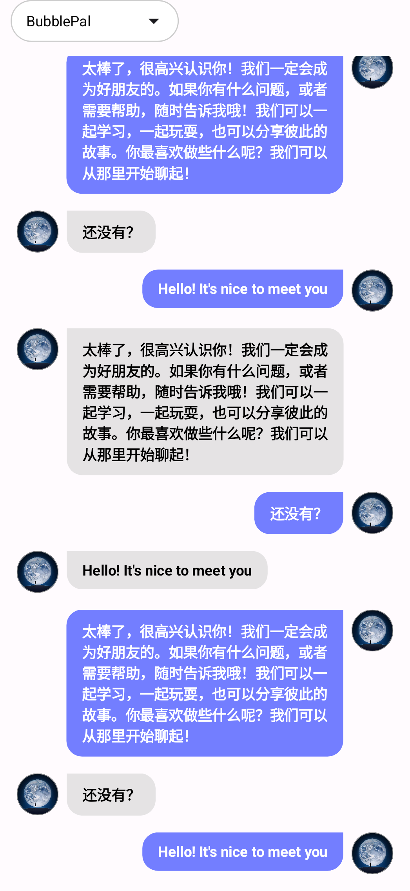
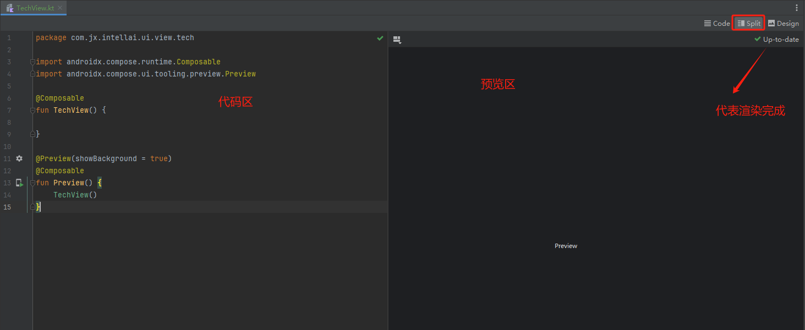
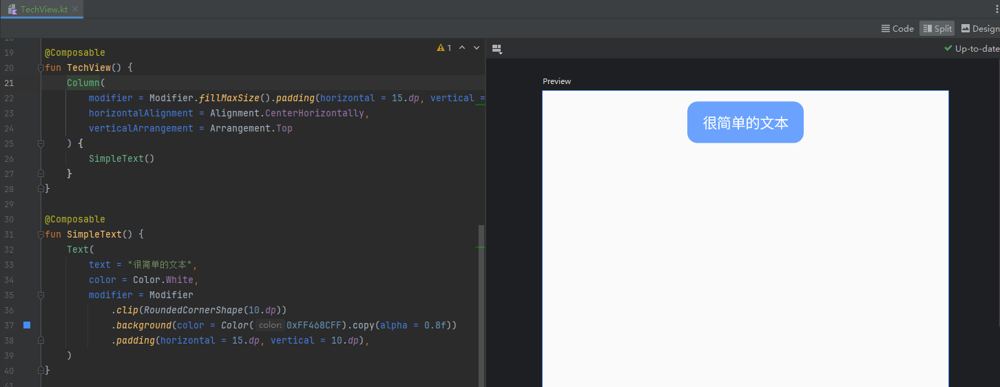
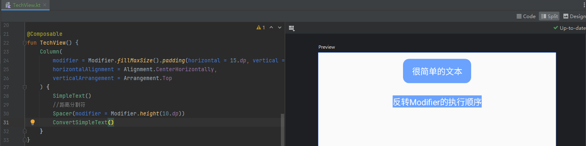
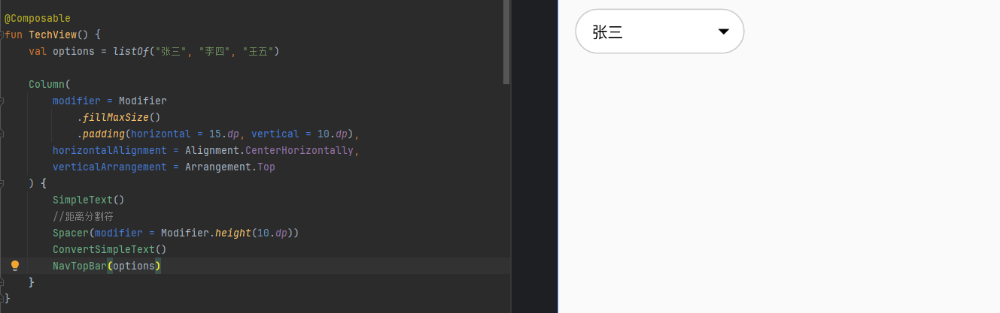
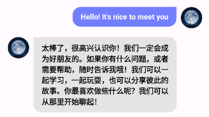
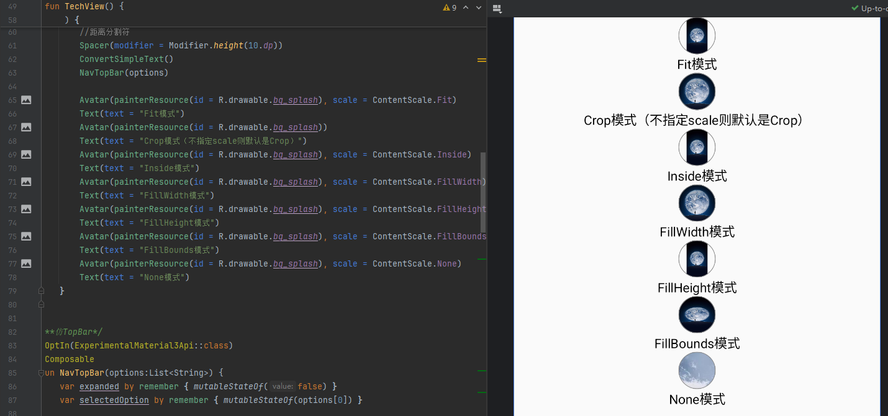
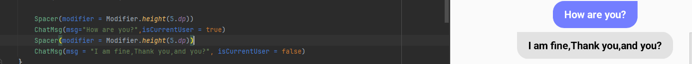

### Jetpack Compose 的优势
   传统的Android View 体系是一种命令式UI,开发人员需要手动操作UI组件的状态,
典型的应用就是通过`findViewById`拿到控件的实例,再调用`setText()`、`setVisibility()` 等方法直接修改UI。
   在使用上，传统的Android View 体系采用xml进行界面布局,通过java/kotlin加载布局进行逻辑控制,
   1. 编写方式相对原始,更改UI可能需要同时修改xml或者java/kotlin;
   2. UI状态与数据源容易不同步，需手动保证一致性;
   3. 频繁操作视图易引发过度绘制或布局嵌套问题,存在性能隐患。

   Jetpack Compose是一种现代化的声明式UI,开发者通过搭积木的方式使用组合函数构建好最终的UI形态,
Jetpack Compose框架会自动处理状态变化后的更新(简化了传统View的数据源同步问题),当数据发生变化后，框架会触发重组，仅更新受影响的部分(优化了传统View体系的性能隐患),除此之外

   1. Jetpack Compose 完全使用kotlin编写UI,告别了xml与java/kotlin的双重维护
   2. 组合优于继承，使用简单的函数组合构建复杂的UI，无需多层继承或者重写
   3. @Preview 在Android Studio中实时预览组件效果
   4. 可在Compose中嵌入传统View组件（如 AndroidView），支持渐进式迁移,同时Compose未来将支持跨平台（如 Compose Multiplatform），减少多平台UI开发成本(无缝兼容过去,未来无限)

### Jetpack Compose 使用基础
   我们这里使用一个简单的示例来演示下Jetpack Compose在构建UI上的使用场景
  
   要实现这样的一张UI图片,需要怎么做,在传统的Android View体系中,我们需要编写一个布局文件,然后在Activity中加载这个布局，并通过findViewById拿到控件实例进行UI的构建,但是在Jetpack Compose中,我们只需要编写一个Composable函数即可实现这个UI的构建

### 编写第一个Composable函数

我们新建一个kt文件,并编写以下的模版代码,`@Composable`注解表示该UI组件可以被组合使用,`@Preview`注解表示该Composable函数可以在Android Studio中预览效果
```java
@Composable
fun TechView() {

}

@Preview(showBackground = true)
@Composable
fun Preview() {
    TechView()
}
```
在Android Studio中,点开Split标签可以看到如下界面:


有了这个模版代码,接下来我们的界面实现就可以做到所见及所得

我们编写了一个简单的`SimpleText`函数,并将其塞到了`TechView`页面的`Column`布局中,可以看到预览效果如下所示:

```kotlin
@Composable
fun TechView() {
    Column(modifier = Modifier.fillMaxSize()) {
        SimpleText()
    }
}

@Composable
fun SimpleText(){
    Text(
        text = "很简单的文本",
        color = Color.White,
        modifier = Modifier
            .clip(RoundedCornerShape(10.dp))
            .background(color = Color(0xFF468CFF).copy(alpha = 0.8f))
            .padding(horizontal = 15.dp, vertical = 10.dp),
    )
}
```
等待渲染完成后,我们可以看到如下的效果


在Jetpack Compose UI框架中，修饰符（Modifier）的执行顺序是先执行后添加的修饰符。添加顺序不同,效果会有差异,如上示例的执行顺序是padding->background->clip。

我们尝试反转下Modifier的执行顺序,如下所示:

```kotlin
@Composable
fun TechView() {
    Column(
        modifier = Modifier.fillMaxSize().padding(horizontal = 15.dp, vertical = 10.dp),
        horizontalAlignment = Alignment.CenterHorizontally,
        verticalArrangement = Arrangement.Top
    ) {
        SimpleText()
        //距离分割符
        Spacer(modifier = Modifier.height(10.dp))
        ConvertSimpleText()
    }
}

@Composable
fun ConvertSimpleText() {
    Text(
        text = "反转Modifier的执行顺序",
        color = Color.White,
        modifier = Modifier
            .padding(horizontal = 15.dp, vertical = 10.dp)
            .background(color = Color(0xFF468CFF).copy(alpha = 0.8f))
            .clip(RoundedCornerShape(10.dp)),
    )
}
```

可以看到,反转后,圆角都被padding覆盖了,基本看不出圆角效果了。

当然通过这两个简单的示例,我们可以管中窥豹,Jetpack Compose的强大之处在于其声明式的UI构建方式，通过组合不同的Composable函数和修饰符，我们可以轻松地创建复杂且响应式的用户界面

### 构建聊天页面
回到我们之前的聊天页面,我们尝试使用Jetpack Compose来实现这个界面，首先需要解构页面的各个组件.
我们可以将聊天页面拆分为以下几个部分：
1. 顶部导航栏：下拉选择控件
> 就像传统View体系一样,jetpack compose也有自己的内置组件可以实现特定的需求,这个控件我们可以使用下拉菜单控件`DropdownMenu`,下拉选择控件`ExposedDropdownMenuBox`来实现,当然如果有特殊需求,我们也可以自定义控件来实现这个功能。

2. 聊天内容区域：显示消息列表

顶部导航栏解构
拆解后的顶部导航栏应该是 有一个下拉状态栏靠左侧.因此整体是一个Row横向布局,下拉选择控件靠左侧，右侧无内容。

```kotlin
/**仿TopBar*/
@OptIn(ExperimentalMaterial3Api::class)
@Composable
fun NavTopBar(options:List<String>) {
    var expanded by remember { mutableStateOf(false) }
    var selectedOption by remember { mutableStateOf(options[0]) }

    Row {
        ExposedDropdownMenuBox(
            expanded = expanded,
            modifier = Modifier.widthIn(max = 150.dp),
            onExpandedChange = { expanded = !expanded }
        ) {
            Row(
                Modifier
                    .background(
                        colorResource(id = R.color.white),
                        shape = RoundedCornerShape(20.dp)
                    )
                    .height(40.dp)
                    .border(
                        width = 1.dp, color = Color.LightGray,
                        shape = RoundedCornerShape(20.dp)
                    ),
                verticalAlignment = Alignment.CenterVertically,
            ) {
                BasicTextField(
                    value = selectedOption,
                    onValueChange = { /* Handle text change */ },
                    enabled = false,
                    modifier = Modifier
                        .padding(start = 15.dp)
                )
                IconButton(onClick = { expanded = !expanded }) {
                    ExposedDropdownMenuDefaults.TrailingIcon(expanded = expanded)
                }
            }

            ExposedDropdownMenu(
                expanded = expanded,
                onDismissRequest = { expanded = false }
            ) {
                options.forEach { selectionOption ->
                    DropdownMenuItem(
                        onClick = {
                            selectedOption = selectionOption
                            expanded = false
                        },
                        text = { Text(selectionOption) }
                    )
                }
            }
        }
        Spacer(modifier = Modifier.weight(1f))
    }
}

```
其中`ExposedDropdownMenuBox`是盒子布局,有点类似传统View中的`FrameLayout`层叠布局,越后面添加的显示在顶层,以确保不会被前面的控价遮挡,我们使用`Row`空间实现横向布局,通过`BasicTextField`和`IconButton`组合出下拉选择控件,`ExposedDropdownMenu`实现下拉菜单的展示。最后使用`Spacer`实现占位.如果右侧还有其他控件仍可继续添加,这里我们使用了一些状态管理,通过`mutableStateOf`定义下拉菜单的展开状态和当前选中的选项。确保组件重组的时候,下拉菜单的状态和选中项能够保持记录不会丢失.

以上的代码效果如下:


> 实现上,我们采用了`BasicTextField`,虽然`OutlinedTextField`更合适,因为`OutlinedTextField`还内置支持尾随图标,但在使用过程中发现,`OutlinedTextField`限制了默认的最小宽高,所以使用`BasicTextField`进行更自由的定制.

### 聊天列表的实现
传统的View体系一般是通过`RecyclerView`来实现列表的展示,在Jetpack Compose中也有对应的组件实现列表的展示，那就是`LazyColumn`,`LazyRow`,`LazyVerticalGrid`,`LazyHorizontal`,`Column`,`Row`等,这里我们使用`LazyColumn`来实现聊天列表的展示。

> `LazyColumn`是一个动态布局组件，它只会渲染屏幕上可见的子组件,适用于子组件数量较多或动态变化的情况，因为它可以有效地回收和重用子组件，减少内存占用和提升性能。
`Column`是一个静态布局组件，它会立即渲染所有子组件,用于子组件数量较少或固定的情况



#### 关于头像的实现

对话item的布局大致可以分为两部分，左侧气泡和右侧气泡
左侧气泡一般是我方会话的气泡,右侧是对方会话的气泡,都是典型的`Row`横向布局,只不过头像和气泡的对调,气泡的背景色也不同。这个我们可以通过简单的逻辑判断,将实现写在一个Composable函数中,并通过参数控制气泡的对调。

这个头像是一个圆形图片,我们可以使用对应的`CircleImage`组件来实现或者我们可以`Image`并借助强大的`Modifier`修饰符来实现圆形图片组件，代码如下所示:
```kotlin
@Composable
fun Avatar(painter: Painter,scale:ContentScale = ContentScale.Crop) {
    Image(
        painter = painter,
        contentDescription = "Avatar",
        contentScale = scale,
        modifier = Modifier
            .size(40.dp)
            .clip(CircleShape)
            .border(0.5.dp, Color.Gray, CircleShape)
    )
}
```

> 这里我们限定了图片的宽高为40dp,并通过`clip(CircleShape)`修饰符实现了圆形裁剪，最后通过`border`修饰符添加了边框

这里需要说明下图像的缩放策略`ContentScale`
|-|-|
|策略|说明|
|Fit|保持图像比例，填充边界但不裁剪|
|Crop|裁剪边界，保持图像比例不变|
|Inside|类似于Fit，但图片会居中显示，且宽度和高度都不会超过容器的对应尺寸|
|FillWidth|填充宽度，保持图像比例不变|
|FillHeight|填充高度，保持图像比例不变|
|FillBounds|填充边界，可能导致图像变形|
|None|不缩放，保持图像原始大小|



#### 聊天气泡文本内容的实现
聊天气泡中的问题内容,我们可以通过`Text`组件来实现,关于气泡的圆角效果，我们发现我方的气泡,右上角没有圆角,对方的气泡左上角无需圆角.

```kotlin
@Composable
fun ChatMsg(msg:String,isCurrentUser:Boolean = true) {
    Column(
        modifier = Modifier
            .animateContentSize()
            .background(
                color = if (isCurrentUser) Color(0xFF737EFF) else Color.LightGray.copy(alpha = 0.5f),
                shape = RoundedCornerShape(
                    topStart = if (isCurrentUser) 15.dp else 0.dp,
                    topEnd = if (isCurrentUser) 0.dp else 15.dp,
                    bottomStart = 15.dp,
                    bottomEnd = 15.dp
                )
            )
            .padding(vertical = 10.dp, horizontal = 15.dp),
        verticalArrangement = Arrangement.Center
    ) {
        Text(
            modifier = Modifier.widthIn(max = LocalConfiguration.current.screenWidthDp.dp * 0.6f),
            color = if (isCurrentUser) Color.White else Color.Black,
            text = msg,
            fontWeight = FontWeight.Bold,
            fontSize = 14.sp,
            maxLines = Int.MAX_VALUE,
            overflow = TextOverflow.Ellipsis
        )
    }
}
```
在构建聊天气泡的文字Item组件时,我们通过`isCurrentUser`标识当前会话是否为我方,通过`RoundedCornerShape`修饰符实现气泡的圆角效果.并通过`animateContentSize()`修饰符实现了内容变化时的动画效果,通过`isCurrentUser`标识结合`RoundedCornerShape`,实现了我们上面提出的不同的会话,圆角效果差异性处理,`isCurrentUser`标识还决定了气泡的背景色



> 另外我们还需要限制气泡的最大宽度,避免气泡内容过长导致气泡宽度过大。这里我们可以使用`LocalConfiguration.current.screenWidthDp.dp`获取当前屏幕宽度的dp值，并将其转换为Dp类型,代码中我们要求气泡的最大宽度不超过屏幕宽度的60%

### 聊天列表整合


### 导航与多页面
   一个应用是由很多页面组成的,传统的View体系一般是通过`startActivity`实现页面的跳转,
在Jetpack Compose中也有对应的库来实现页面的跳转,
在项目的 build.gradle (Module级别) 中添加依赖：
```gradle
dependencies {
    implementation "androidx.navigation:navigation-compose:2.7.7"  // 使用最新版本
}
```
这个导航库有三个关键的核心组件
1. NavController：管理导航逻辑和返回栈
2. NavHost：容器，用于承载不同页面（Composable函数）
3. NavGraph：定义页面间的导航关系

### 结合ViewModel进行状态管理
Composable 函数仅负责渲染 UI,而ViewModel 负责管理业务逻辑和 UI 无关的状态，一般采用Hilt注入框架避免`ViewModel`直接实例化,

在使用ViewModel需要引入
```gradle
implementation "androidx.lifecycle:lifecycle-viewmodel-compose:2.7.0"  // 最新版本
```
获取ViewModel实例的几种方式
1. 直接通过 viewModel() 函数获取（需 Compose 环境）：
```kotlin
@Composable
fun MyScreen(viewModel: MyViewModel = viewModel()) {
    // 使用 viewModel 中的状态和方法
}
```
2. 通过 Activity/Fragment 传递 ViewModel（适合跨组件共享）：
```kotlin
// 在 Activity 中初始化
val viewModel: MyViewModel by viewModels()
setContent { MyScreen(viewModel) }
```

3. 依赖注入：使用 Hilt 或 Koin 实现 ViewModel 的依赖注入（提高可测试性）
以下是一个ViewModel定义
```kotlin
@HiltViewModel
class MyViewModel @Inject constructor() : ViewModel() {
    private val _uiState = MutableStateFlow<UiState>(UiState.Loading)
    val uiState: StateFlow<UiState> = _uiState.asStateFlow()

    init {
        loadData()
    }

    private fun loadData() {
        viewModelScope.launch {
            _uiState.value = UiState.Loading
            try {
                val data = fetchDataFromNetwork()
                _uiState.value = UiState.Success(data)
            } catch (e: Exception) {
                _uiState.value = UiState.Error(e.message)
            }
        }
    }

    /**逻辑状态 */
    sealed class UiState {
        object Loading : UiState()
        data class Success(val data: String) : UiState()
        data class Error(val message: String?) : UiState()
    }
}
```
在这个`ViewModel`中,我们定义了逻辑所需的状态`UiState`,`MutableStateFlow`是 Kotlin 协程中的 热流（Hot Flow），始终持有最新的状态值,通过 `asStateFlow()` 转换为只读的 StateFlow，防止外部直接修改状态
当`_uiState`的数据发生变化时,对外暴露的`uiState`会立即通知所有活跃的收集者`Collector`,而`collectAsState()`会将`Flow`转化为`Compose`所需的`State`,当Flow发出新值,State会更新，从而触发组件重组

```kotlin
@Composable
fun MyScreen(viewModel: MyViewModel = hiltViewModel()) { 
    val uiState by viewModel.uiState.collectAsState()

    when (val state = uiState) {
        is UiState.Loading -> {
            // 显示加载动画
            CircularProgressIndicator()
        }
        is UiState.Success -> {
            // 显示数据
            Text("Data: ${state.data}")
        }
        is UiState.Error -> {
            // 显示错误信息，并提供重试按钮
            Column {
                Text("Error: ${state.message}")
                Button(onClick = { viewModel.loadData() }) {
                    Text("Retry")
                }
            }
        }
    }
}
```


### 一些常见的需求实现案例

1. 沉浸式状态栏
```kotlin
ProvideWindowInsets() {
    val systemUiController = rememberSystemUiController()
    SideEffect {
        systemUiController.setStatusBarColor(Color.Transparent, darkIcons = false)
    }
    Surface(
        modifier = Modifier.fillMaxSize().navigationBarsPadding(),
        color = customScheme.background
    ) {
        //content
    }
}
```

### 参考链接
1. [Android 全新的 UI 框架](https://www.cnblogs.com/joy99/p/18035909)
2. [Android 上的 Kotlin 协程](https://developer.android.google.cn/kotlin/coroutines?hl=zh-cn)