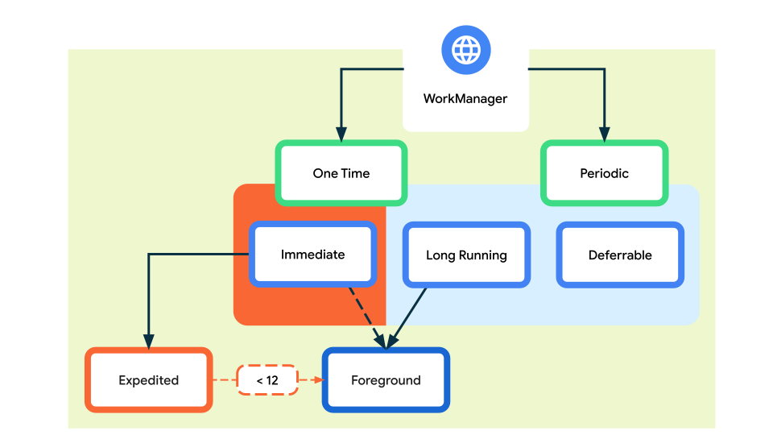

### 概述
WorkManager是Google在Android Jetpack中提供的一个组件,用于在应用后台执行任务.WorkManager可以保证即使应用未运行,也可以正常运行任务.
WorkManager支持多种任务类型,如一次性任务、周期性任务等.WorkManager会根据任务的优先级和约束条件,自动选择合适的执行时机来运行任务.
WorkManager 适合以下几种场景:



### 适用场景
在使用之前,我们需要了解我们的需求是否真的需要使用WorkManager.
1. 首先WorkManager是无法保证实时性的,对于实时性要求比较高的场景,建议使用AlarmManager.WorkManager并不适合
2. 好的,如果你的任务需求可以延迟处理,那么WorkManager是一个不错的选择.
3. WorkManager 还提供了强大的持久化机制，它可以将工作请求保存到存储中，并在设备重启后恢复它们。这意味着，即使在应用进程被终止且设备重启后，工作请求也不会丢失，而是会按照之前的计划继续执行,你的任务在应用退出时还需要继续吗? 那简直就是为你的需求量身定做的啊.

### 依赖库引入
WorkManager方案.需要引入如下依赖
```java
// WorkManager支持(java版本) 实现定时任务
implementation "androidx.work:work-runtime:2.7.1"
// WorkManager支持(kotlin版本) 根据实际情况选择使用
// implementation "androidx.work:work-runtime-ktx:2.7.1"
```

### 个性化定制指南
```java
// 约束：网络连接可用的情况下才开启定时任务
Constraints constraints = new Constraints.Builder()
    .setRequiredNetworkType(NetworkType.CONNECTED)
    .build();

// 创建周期性任务,用于上报流量
// 24小时执行一次,首次启动延迟10秒后再执行
PeriodicWorkRequest periodicWorkRequest = new PeriodicWorkRequest.Builder(UploadWorker.class, 24, TimeUnit.HOURS)
    .addTag("SendNetData")
    .setInitialDelay(10, TimeUnit.MILLISECONDS)
    .setConstraints(constraints)
    .build();
// ExistingPeriodicWorkPolicy.CANCEL_AND_REENQUEUE 如果有重复的任务,则删除之前的任务,并重新添加
WorkManager.getInstance(this).enqueueUniquePeriodicWork("upload", ExistingPeriodicWorkPolicy.CANCEL_AND_REENQUEUE,periodicWorkRequest);    
```
以下是`UploadWorker`的简单例子
```java
public class UploadWorker extends Worker {
    @NonNull
    @Override
    public Result doWork() {
        // 执行任务,你可以在这里执行耗时任务
        return Result.success();
    }
}
```

### 参考链接
1. [Android后台任务-Google](https://developer.android.com/develop/background-work/background-tasks/persistent/getting-started/define-work?hl=zh-cn#kotlin)


