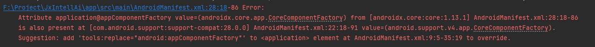
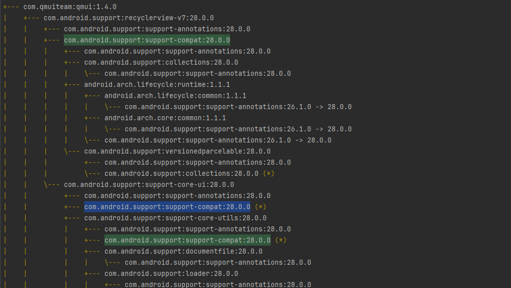

### 依赖冲突问题
在开发过程中,经常需要引入第三方依赖来加快开发的速度,但是引入的依赖包之间可能会存在冲突,导致项目编译失败.这里主要来探讨下怎么解决依赖冲突的问题.

### 定位依赖冲突的位置
如下图显示,字面上意思`application@appComponentFactory`的值在`androidx.core:core:1.13.1`和`com.android.support:support-compat:28.0.0`都有定义不知道使用哪个,需要开发者显示指定使用哪个配置

快速解决的方法也有，就如提示所说,直接在AndroidManifest.xml中指定使用哪个配置即可
`tools:replace="android:appComponentFactory"`,如果我们想追究`com.android.support:support-compat:28.0.0`哪里引入这个额外的依赖.就需要使用依赖分析工具来定位.
```gradle
./gradlew app:dependencies
```
原来是引入了`qmui`的副作用啊.

