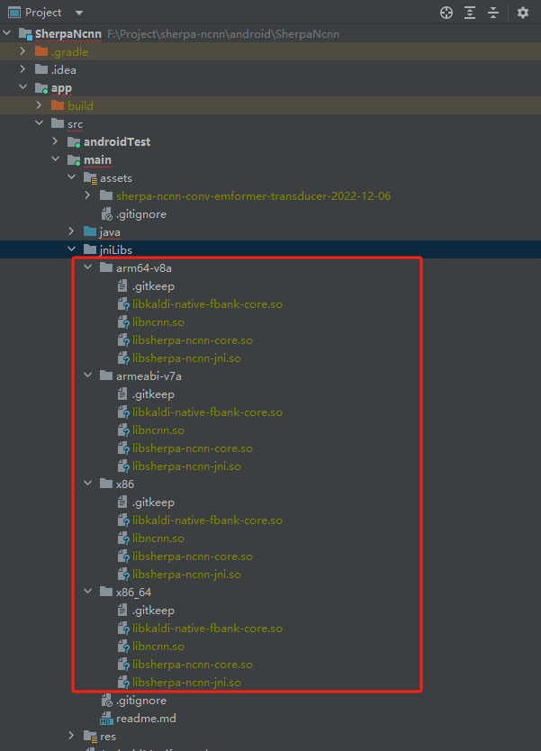
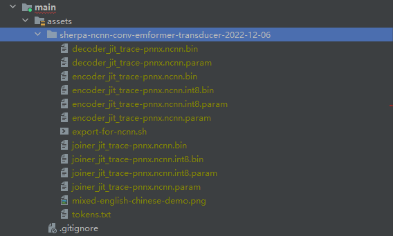

### 构建 sherpa-ncnn
官方提供的构建脚本需要在Linux/MacOS平台,选择的NDK版本`22.1.7171670`,由于我这里使用的是Window平台,所以直接使用[预编译的库](https://github.com/k2-fsa/sherpa-ncnn/releases).

这里需要注意的是[需要删除 Android NDK 中的硬编码调试标志以修复 android-ndk 问题](https://github.com/android/ndk/issues/243)

### Demo构建
下载[SherpaNcnnDemo代码](https://github.com/k2-fsa/sherpa-ncnn/tree/master/android/SherpaNcnn)

把我们下载的so库放置到`jniLibs`目录下


### 预训练模型选择
在Demo的注释中指示了哪些可用的预训练模型,可根据需要进行下载.下载解压后放置在`assets`目录下
```kt
/*
@param type
0 - https://huggingface.co/csukuangfj/sherpa-ncnn-2022-09-30
    This model supports only Chinese

1 - https://huggingface.co/csukuangfj/sherpa-ncnn-conv-emformer-transducer-2022-12-06
    This model supports both English and Chinese

2 - https://huggingface.co/csukuangfj/sherpa-ncnn-streaming-zipformer-bilingual-zh-en-2023-02-13
    This model supports both English and Chinese

3 - https://huggingface.co/csukuangfj/sherpa-ncnn-streaming-zipformer-en-2023-02-13
    This model supports only English

4 - https://huggingface.co/shaojieli/sherpa-ncnn-streaming-zipformer-fr-2023-04-14
    This model supports only French

5 - https://github.com/k2-fsa/sherpa-ncnn/releases/download/models/sherpa-ncnn-streaming-zipformer-zh-14M-2023-02-23.tar.bz2
    This is a small model and supports only Chinese
6 - https://github.com/k2-fsa/sherpa-ncnn/releases/download/models/sherpa-ncnn-streaming-zipformer-small-bilingual-zh-en-2023-02-16.tar.bz2
    This is a medium model and supports only Chinese

Please follow
https://k2-fsa.github.io/sherpa/ncnn/pretrained_models/index.html
to add more pre-trained models
 */
fun getModelConfig(type: Int, useGPU: Boolean): ModelConfig?
```
比如这里我选择使用`sherpa-ncnn-conv-emformer-transducer-2022-12-06` 这是一个中英双语支持的模型


至此项目应该就可以编译运行起来


### 参考链接
1. [build-sherpa-ncnn](https://k2-fsa.github.io/sherpa/ncnn/android/build-sherpa-ncnn.html)
2. [SherpaNcnnDemo代码](https://github.com/k2-fsa/sherpa-ncnn/tree/master/android/SherpaNcnn)