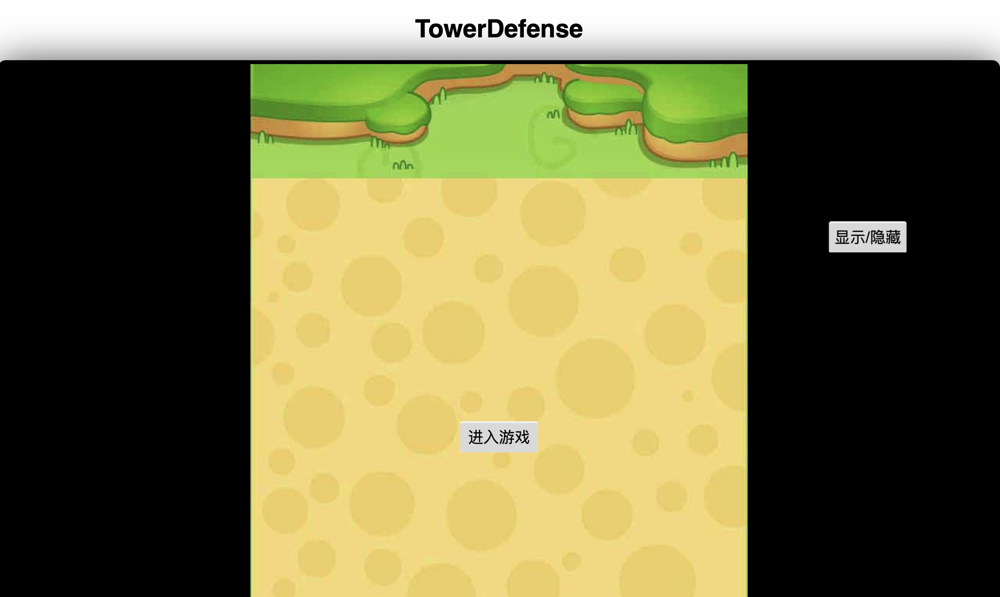
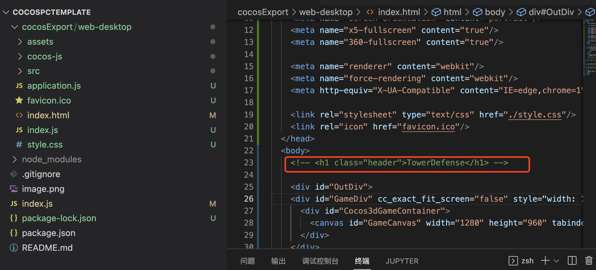
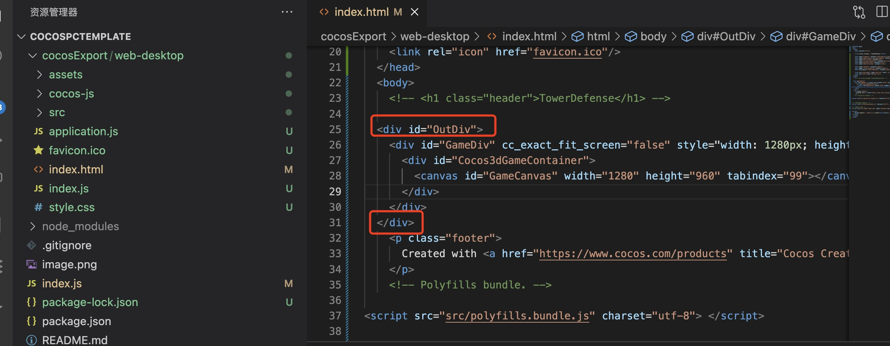
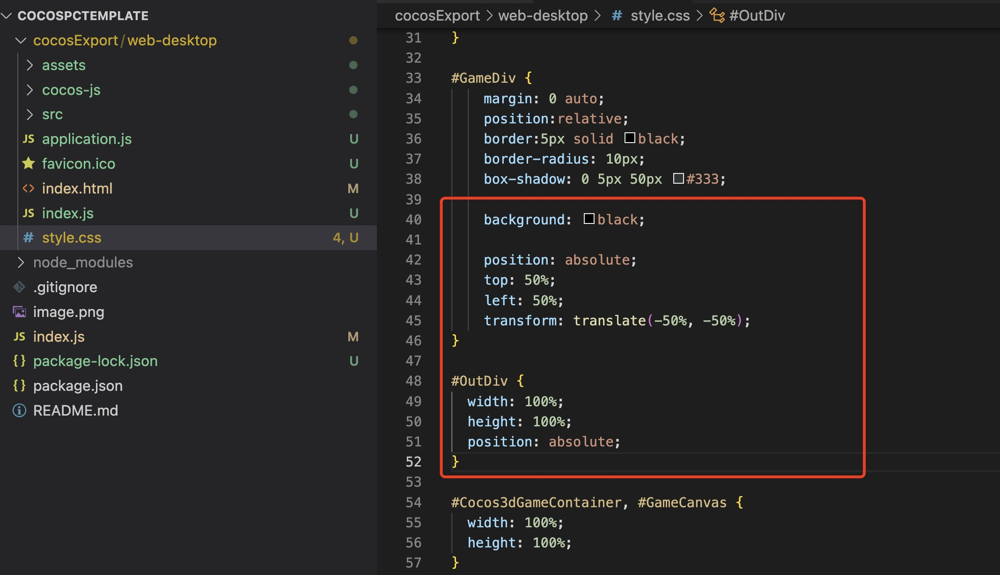
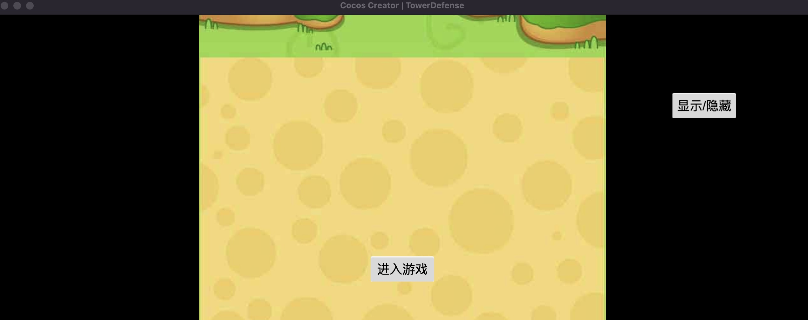
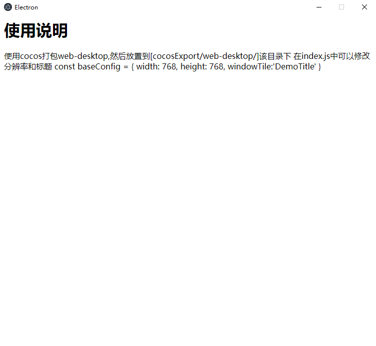

### 配置修改
使用cocos打包的web-desktop构建的版本,在运行时会有个标题很难看,需要做相应的修改


### 去掉index.html中的标题
打开web-desktop中的`index.html`,将标题注释掉,如下图所示


为id为`GameDiv`的Div外面再封装一层Div

并扩展样式

```css
#GameDiv {
    margin: 0 auto;
    position:relative;
    border:5px solid black;
    border-radius: 10px;
    box-shadow: 0 5px 50px #333;

    /*{@ 以下内容为新增样式 */
    background: black;
    position: absolute;
    top: 50%;
    left: 50%;
    transform: translate(-50%, -50%);
    /**@} */
}

/**{@ 以下内容为新增样式 */
#OutDiv {
  width: 100%;
  height: 100%;
  position: absolute;
}
/**@}*/
```
现在标题成功去除了



### 模版
你也可以直接使用该模版 [cocosPcTemplate](https://github.com/MeDeity/cocosPcTemplate)



### 参考链接
1. [实用！Cocos Creator 游戏发布 Steam 平台攻略出炉](https://mp.weixin.qq.com/s/hxGYUWYU5vhtl82_kk3v2Q?scene=21#wechat_redirect)
2. [Cocos+b站弹幕互动玩法](https://mp.weixin.qq.com/s/Gvx6IQKEoOG12DzqxxMFEA)
3. [cocoscreator web端游戏界面去除信息和全屏居中显示](https://blog.csdn.net/springleaf2/article/details/123046748)