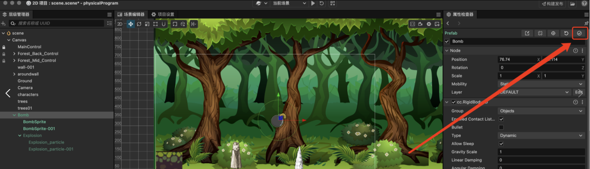

在 Cocos Creator 3.x 中，如果你遇到了 MotionStreak（拖尾效果）预置体无法显示的问题，这个我认为是编译器的BUG,但目前可以使用以下方式进行修复
查询了方案,说可以拖动到Canvas,然后使用右上角的按钮同步到预置体资源进行修复：

目前方案待待进一步验证,后续更新。

### 参考链接
1. [cocos creator 3.x 预制体无法显示](https://blog.csdn.net/weixin_42815873/article/details/136059239)