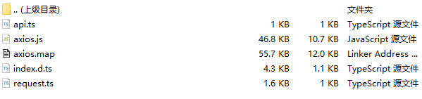

### 概述
在cocos中请求一些接口是需要用到axios, 使用npm安装axios后,尝试使用`import axios from 'axios'`引入使用发现一直黑屏.
大于`0.19`的版本体量较大,强相关依赖nodejs,不便调试,因此从`0.19`版本中进行分离,不再强依赖nodejs.
```bash
npm install --save-dev axios@0.19
```
然后将`axios.js`、`index.d.ts`、`axios.map` 单独拷贝处理使用
以下是我对axios的抽离 [single-axios](images/2024/09/06/single-axios.zip),可以直接下载使用
我新建了个request.ts,对`axios`的实例进行了封装,并在api.ts中使用了封装后的`axios`


以下是`api.ts`的接口示例
```typescript
import request from './request'
/**
 * 获取授权信息
 * @param data {appKey,appSecret}
 * @returns 
 */
export function getAuth(data) {
    return request({
      url: '/getAuth',
      method: 'post',
      data
    })
}
```


### 参考链接
1. [解决cocos creator 3.x使用axios模块问题](https://blog.csdn.net/a17432025/article/details/128922700)