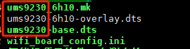

### 查看手机项目属于那个平台
在客需化版本中
```bash
# 例如zprj/FS322L6/board_cfg
cd zprj/xxx/board_cfg
```
可以查看到如下的信息,该信息代表芯片型号



|芯片型号|平台对应|
|-|-|
|UMS9230|T606|
|UMS9230T|T616|
|UMS9621|T750|
|UMS512|T610|
|UMS512T|T618|
|UMS312|T310|


