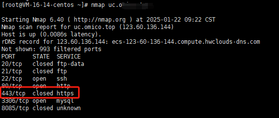
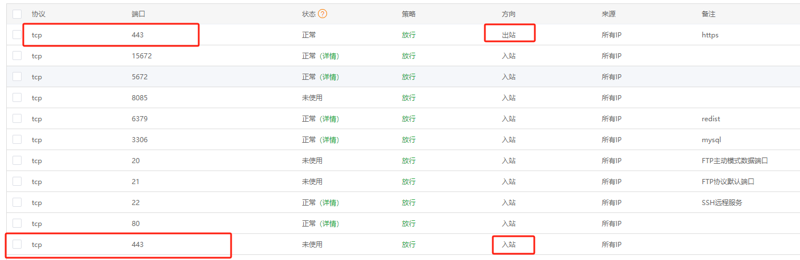

### 问题描述
通过宝塔面板部署SSL证书后，网站无法通过https访问。访问提示`xxx拒绝了我们的连接请求`

通过`nmap`命令发现443端口是关闭的


> `nmap（Network Mapper）`是一个开放源代码的网络探测和安全审核的工具。并被广泛用于网络发现和安全审计,`nmap`可以扫描目标系统上开放的端口，从而确定哪些服务正在运行

### 处理
1. 宝塔面板上开放443端口


2. linux服务器上开放443端口

防火墙相关操作命令如下:
```bash
#查看防火墙是否开启（如果显示running，则防火墙为开启状态）：
firewall-cmd --state

#关闭防火墙：
systemctl stop firewalld.service

#开启防火墙
systemctl start firewalld.service

#关闭开机自启动：
systemctl disable firewalld.service

#开启开机自启动：
systemctl enable firewalld.service
 ​
#开放指定端口 --zone #作用域 --add-port=443/tcp  #添加端口，格式为：端口/通讯协议  --permanent  #永久生效，没有此参数重启后失效
firewall-cmd --zone=public --add-port=443/tcp --permanent
​
# 重启防火墙
firewall-cmd --reload

```

### 安全组开放443端口
如果你的服务器是在云服务商购买的，比如阿里云、腾讯云等，需要在安全组中开放443端口、出站和入站都开放


以上再次运行`nmap`命令，如443端口已经开放,应该能正常通过https访问网站了。


### 参考链接
1. [SSL部署成功，浏览器无法访问，提示访问被拒绝](https://www.bt.cn/bbs/thread-38259-1-1.html)
