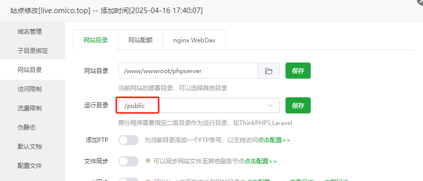

### 项目地址
[yc-digital-human](https://github.com/xhadmincn/yc-digital-human.git)


### 后端部署
后端是基于ThinkPHP6.0框架开发的，部署使用宝塔面板.部署一些注意事项:
1. PHP版本需要推荐使用8.0.2以上版本，需要安装`fileinfo`扩展。
2. 安装完扩展后，需要重启PHP服务。 要不然环境检测时一直显示 `fileinfo`扩展不支持(需要重启生效)。
3. 运行目录设置为`public`

然后访问域名应该就会执行php经典的安装部署了.

这里需要注意下，安装后访问的时候接口一直无法使用,问了下AI， 说是nginx配置问题，然后我把我的nginx配置给AI看后，AI回复说:
> 看到您的 Nginx 配置，我发现缺少了 ThinkPHP 必要的重写规则。您需要在配置文件中添加适当的重写规则来处理 API 请求。

```nginx
#禁止访问的文件或目录
location ~ ^/(\.user.ini|\.htaccess|\.git|\.env|\.svn|\.project|LICENSE|README.md)
{
    return 404;
}
# 以下内容需要额外加入
# 这个配置是为了处理 ThinkPHP 的路由。当你访问 /api/index/config 时：

# - Nginx 首先检查是否存在对应的实体文件
# - 因为这是一个虚拟路由，文件并不存在
# - 所以请求被重写为 /index.php?s=/api/index/config
# - 这样请求就会被传递给 ThinkPHP 的入口文件处理
location / {
    if (!-e $request_filename){
        rewrite ^(.*)$ /index.php?s=$1 last;
        break;
    }
}

# 这个配置告诉 Nginx 如何处理 PHP 文件：

# - 匹配所有 .php 结尾的请求
# - 将请求转发给 PHP-FPM 处理
# - 设置必要的 FastCGI 参数
location ~ \.php$ {
    fastcgi_pass   127.0.0.1:9000;
    fastcgi_index  index.php;
    fastcgi_param  SCRIPT_FILENAME  $document_root$fastcgi_script_name;
    include        fastcgi_params;
}
# 额外加入结束
```


