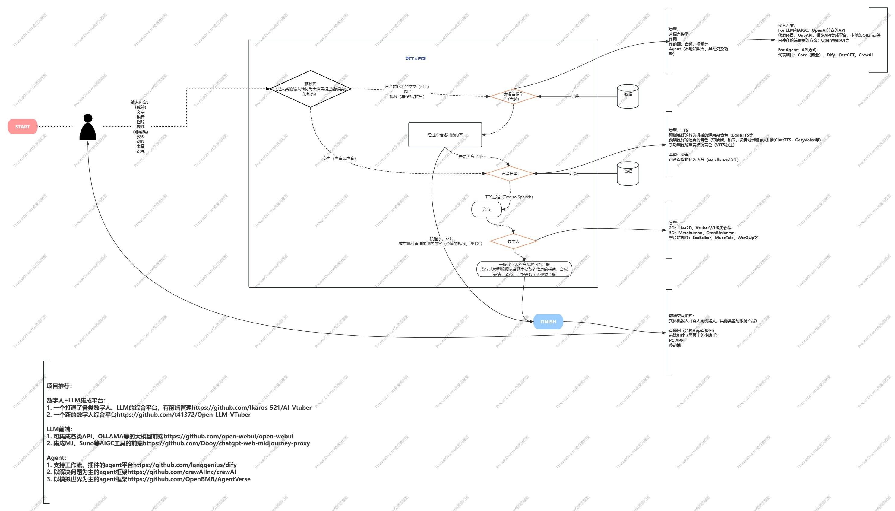

### 数字人方案图示

> 本图来源 [metahuman_overview](https://github.com/YUANZHUO-BNU/metahuman_overview)

### 一些专业术语
1. 语音识别（ASR）
2. 语种识别（LID）
3. 语音情感识别（SER）
4. 声学事件分类（AEC）
5. 声学事件检测（AED）

### 声音克隆方案开源项目
1. [clone-voice](https://github.com/jianchang512/clone-voice)
2. [文字合成为语音](https://github.com/jianchang512/ChatTTS-ui)
3. [metahuman_overview](https://github.com/YUANZHUO-BNU/metahuman_overview)