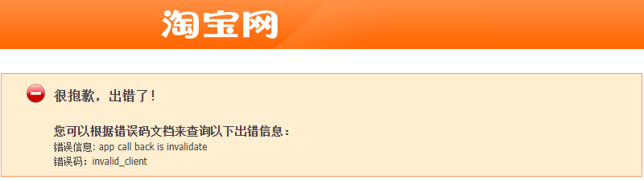

### 淘口令解析&转链(使用客户端SDK实现)
> 但是客户端SDK在哪里下载我现在还没搞清楚

```java
/**
     * @desc 支持通过淘口令解析商品id，并提供对应的淘客转链接  taobao.tbk.sc.tpwd.convert( 淘宝客-服务商-淘口令解析&转链 )
     * @param passwordContent 淘宝商品口令
     * @param adzoneId 推广位ID
     * @param siteId 站点ID
     * @param sessionKey 淘宝客的授权密钥
     * @doc https://open.taobao.com/api.htm?docId=43873&docType=2&scopeId=16401
     * @return
     */
    public TbkScTpwdConvertResponse tbkScTpwdConvert(String passwordContent, Long adzoneId, Long siteId, String sessionKey) {
        TbkScTpwdConvertRequest req = new TbkScTpwdConvertRequest();
        req.setPasswordContent(passwordContent);
        req.setAdzoneId(adzoneId);
        req.setSiteId(siteId);
        try {
            return TbkApiVisit.execute(req,sessionKey);
        } catch (ApiException e) {
            e.printStackTrace();
        }
        return null;
    }
```

### 原生接口拼接
该接口需要进行授权

### 获取SessionKey
[这里有更简便的方法](https://blog.csdn.net/aiharry2009/article/details/50726516)

- 1. 访问 http://my.open.taobao.com/auth/authorize.htm?appkey={appKey} 即可获得授权码
- 2. 通过http方式访问 http://container.open.taobao.com/container?authcode={授权码}；
- 3. 访问第二步后，浏览器会自动跳转到注册appKey的合作方回调地址上。如果注册appKey的时候这个地址的随便填的话，那页面就会显示404了。不过这个不影响，因为sessionKey已经在浏览器的地址栏里面了。
地址栏中会出现类似这样的字符串：top_appkey=1142&top_parameters=xxx&top_session=xxx&top_sign=xxx。字符串里面的top_session值即为SessionKey

### 权限不足 Insufficient isv permissions
[Insufficient isv permissions官方说明](https://open.taobao.com/help?docId=1609&docType=14)

### 签名报错
[Java调用示例代码](https://open.taobao.com/doc.htm?spm=a219a.15212433.0.0.3dfb669aul4LMK&docId=130&docType=1)
使用官方的示例代码提示 `{"error_response":{"code":26,"msg":"Missing session","sub_msg":"传入http参数中必需包含session字段","request_id":"15qu7sjjaziqr"}}`
需要`session`,调试阶段可以在`https://open.taobao.com/apitools/sessionPage.htm` 获取`session`.但是输入AppKey后提示

关于该问题,在这里找到了答案,说是需要设置回调地址
[会员链路：授权sessionkey，提示：app call back is invalidate](https://open.taobao.com/help?docId=1106&docType=14)

[正式环境申请sessionKey](https://www.cnblogs.com/zknu/archive/2013/06/14/3135527.html)

### 参考链接
1. [淘口令解析&转链](https://aff-open.taobao.com/?spm=a219a.13922334.0.0.7d5e24adCTcsML#!/document)
2. [推广商品链接](https://www.cnblogs.com/whqworld/p/16813776.html)
3. [用户授权介绍](https://open.taobao.com/doc.htm?docId=102635&docType=1)
4. [app call back is invalidate](https://open.taobao.com/help?docId=1106&docType=14)
