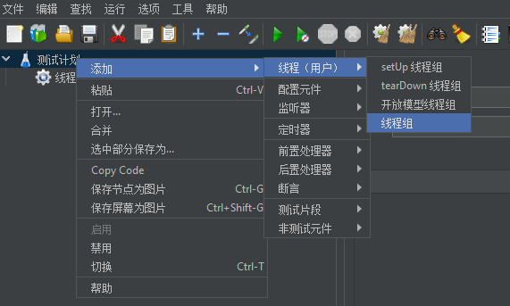
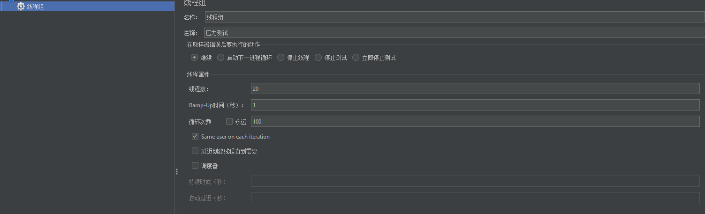

### 查看项目信息(linux)
```bash
# 查看进程信息获取我们项目的PID
ps -ef  | grep java
# 查看Springboot项目默认维护的线程总数量,其中[PID]为我们第一步获取到的Springboot项目进程PID
pstree -p [pid] | wc -l
```

### 压测工具JMETER

#### 应用汉化
默认情况下是英文的,如果需要汉化可以修改`bin/jmeter.properties`文件
```bash
#Preferred GUI language. Comment out to use the JVM default locale's language.
language=zh_CN


# Additional locale(s) to add to the displayed list.
# The current default list is: en, fr, de, no, es, tr, ja, zh_CN, zh_TW, pl, pt_BR
# [see JMeterMenuBar#makeLanguageMenu()]
# The entries are a comma-separated list of language names
#locales.add=zu
```
修改后重启应用应该就可以生效了

#### HTTP压测-线程组配置


右击依次选择 [添加] -> [线程(用户)] -> [线程组]
在JMeter中，线程属性是用于配置负载测试行为的重要部分。以下是一些主要的线程属性：
1. 线程数（Number of Threads）：

    这是模拟并发用户数量的参数。例如，如果你设置线程数为10，
JMeter将模拟10个用户同时访问你的应用。

2. 启动延迟（Ramp-Up Period）：
    这个参数定义了JMeter在启动所有线程之前等待的时间。例如，如果线程数为100，
启动延迟设置为10秒，那么JMeter将在10秒内逐渐启动100个线程

3. 循环次数（Loop Count）：
    这个参数定义了每个线程将执行其所属线程组的测试用例的次数。
你可以设置一个特定的次数，或者选择“无限循环”（Forever）让线程一直执行，直到手动停止




### 参考链接
1. [SpingBoot项目之性能压测并提高并发访问量](https://blog.csdn.net/weixin_36898373/article/details/105645578)