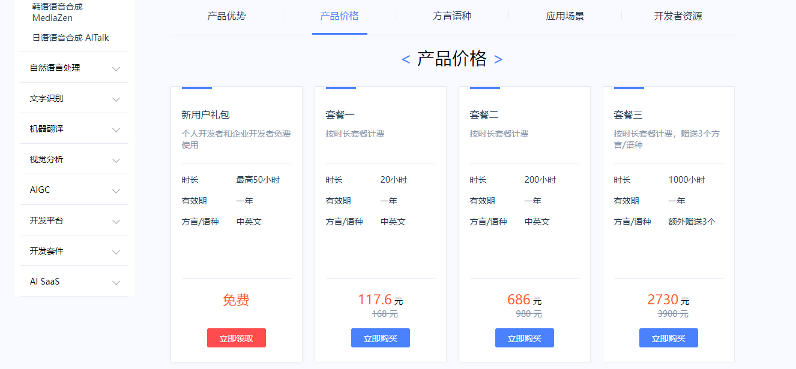

### 现阶段文字转语音服务
现阶段国内语音转文字服务主要有讯飞、阿里云、腾讯云、百度云等，虽然正确率相对较高,但是价格真的死贵死贵的. 普通人基本是玩不起.



### 本地搭建语音转文字服务


### 关于生成项目所需的依赖
一般我们可以使用 pip freeze 命令来生成 requirements.txt 文件
```bash
pip freeze > requirements.txt
```
不过这会列出当前环境中所有已安装的包。如果你想只包含项目实际使用的依赖，可以先创建一个新的虚拟环境，安装必要的包后再运行上述命令
另外，也可以使用 pipreqs 工具，它会分析你的代码并生成实际使用的依赖：
```bash
pip install pipreqs
#一般情况下如果文件包含中文,运行以下命令会有编码问题,需要加上参数 --encoding=utf8
pipreqs path\to\project --encoding=utf8
```
或者先创建虚拟环境
```bash
python -m venv venv
# 激活虚拟环境（Windows）,退出虚拟环境用deactivate 
.\venv\Scripts\activate
# 安装项目所需的包后，使用：
pip freeze > requirements.txt
```
> python -m venv 调用 Python 的 venv 模块, 最后的 venv 是虚拟环境的目录名称（可以改成其他名字）


