# Jenkins实现Vue项目自动化部署

### 目标
我们在编写代码并测试通过后,希望能够自动部署到线上,我们期望在dev分支上的更改,当同步到master分支时,会自动发起构建

```bash
# 新建dev分支进行项目开发
git checkout -b dev
# dev 分支进行更新 & 长时间的测试
git add . & git commit -m "something update" & git push origin dev
# 合并到主分支
git checkout master & git merge dev & git push origin master

# 触发自动化部署....
```

### 安装NodeJs插件
Vue项目自动化部署需要确保Jenkins服务器上安装了NodeJs插件，否则无法执行npm命令。
在插件管理页面搜索NodeJs插件，并安装。安装后会出现在已安装的插件列表中。如下图所示

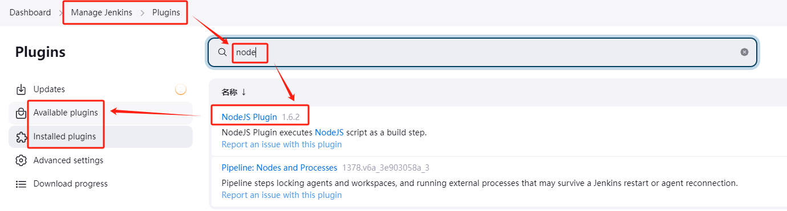

### 安装Publish Over SSH插件
这个组件主要是将构建好的项目发布到远程服务器上。

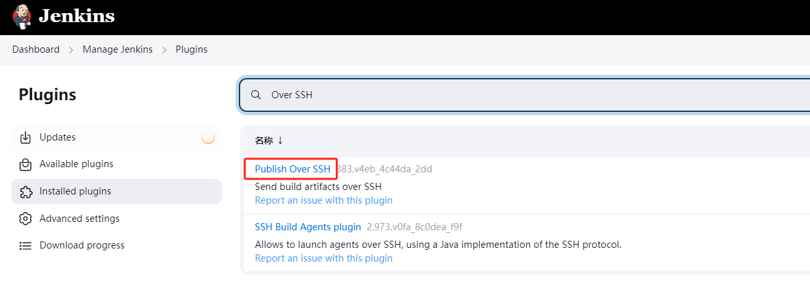

### 安装Git插件
由于我们的代码一般托管在Git上，所以需要安装Git插件来访问代码仓库

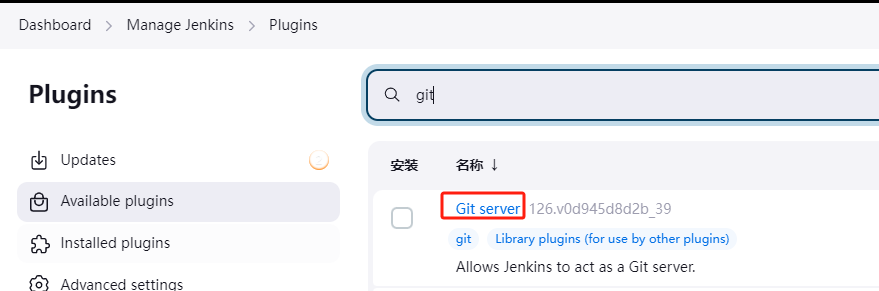


### 配置插件

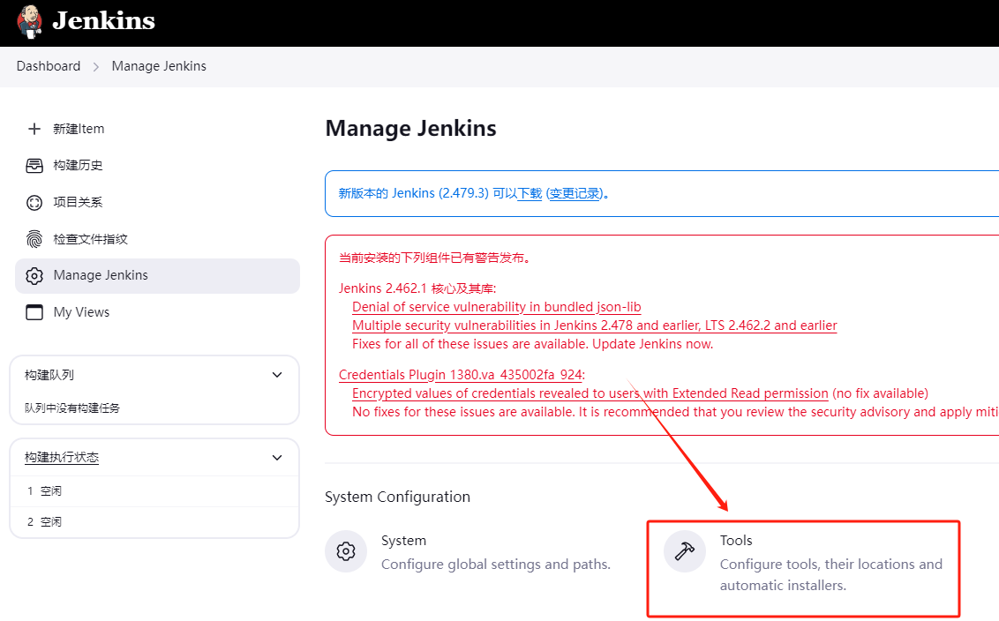

1. 配置NodeJs插件
上面我们已经安装了NodeJs插件，NodeJs插件辅助jenkins对NodeJs进行调用。如果之前没有安装过NodeJs,则需要先安装NodeJs.

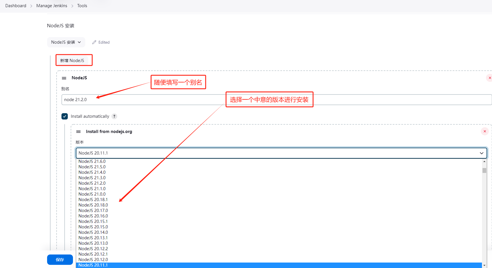

2. 配置SSH插件

设置远程服务器的信息,其中Romete Directory指的是默认上传的根目录,一般推荐直接写为`/`,这样上传的文件就会出现在远程服务器的根目录下。

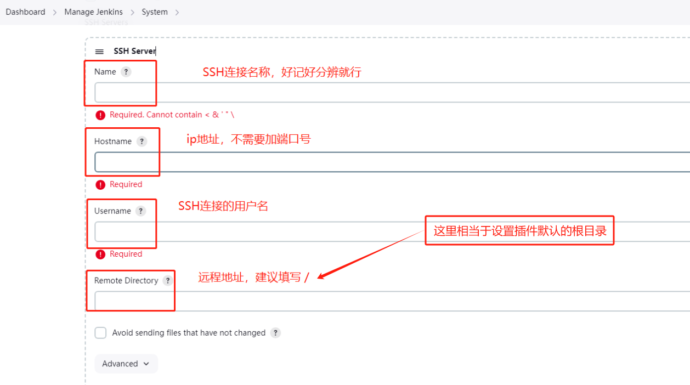

设置SSH密钥,用于Jenkins服务器与远程服务器的免密登录。

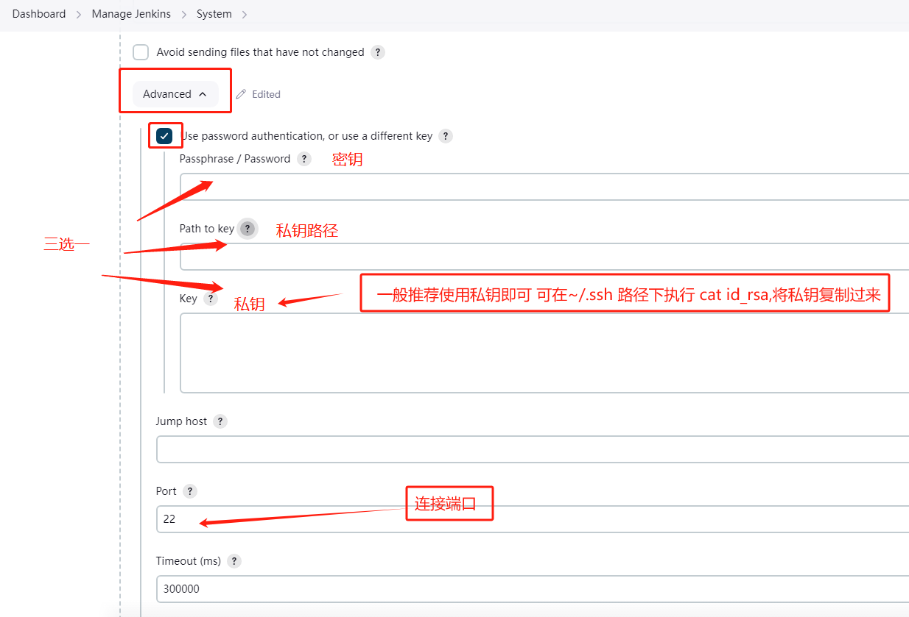

### 自动化任务构建
Jenkins为各种任务的构建提供了模版,这里我们选择一个自由风格的项目进行构建
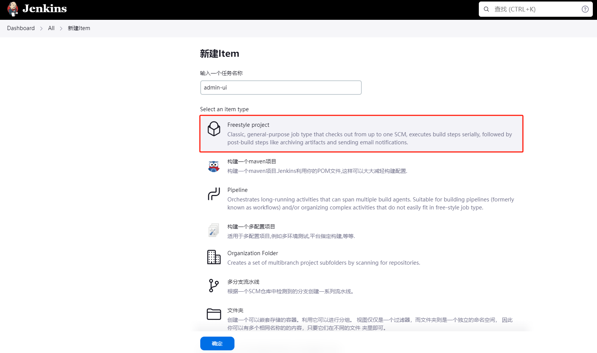

### 任务构建配置
1. 首先是一个项目的任务描述,一般情况下在Jenkins上会发布很多的任务,过一段时间,可能单通过名字已经很难知道这个任务构建是用来干嘛的.所以需要这个任务描述以便后期记忆

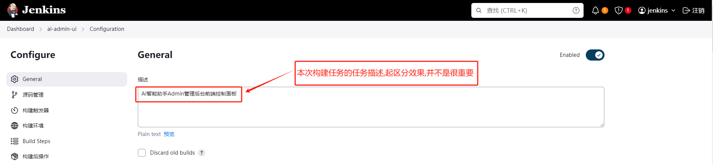

2. 设置待构建仓库的项目地址

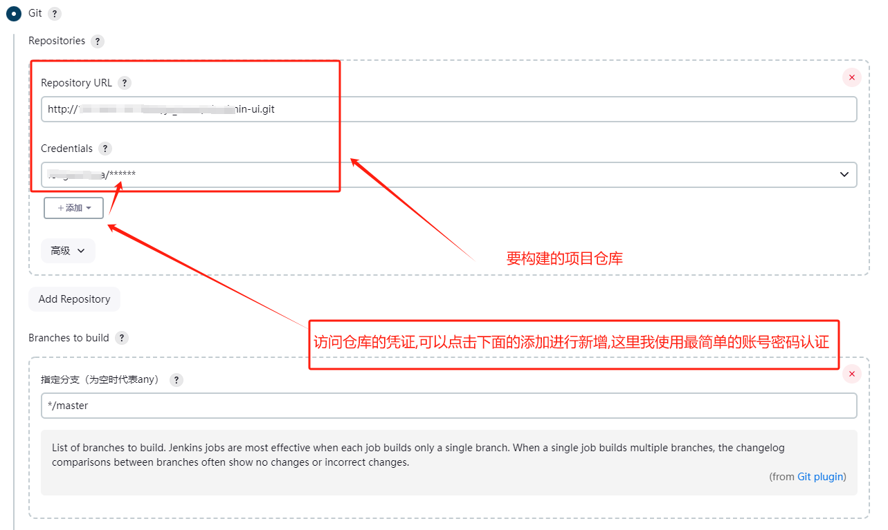

这里有个很好用的设置,可以选择部署哪个分支,那么我们可以在`dev`分支上开发,验证成功了。在同步推送到`master`分支
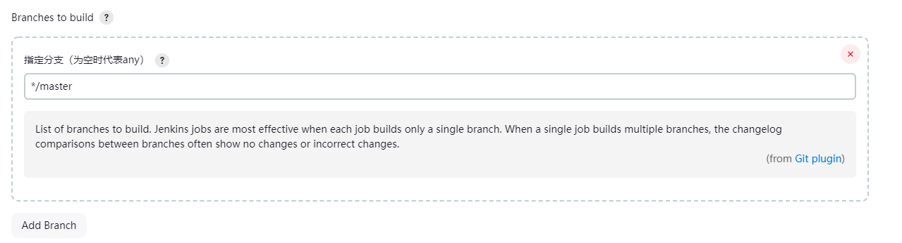


### 触发构建
这个就是自动构建的灵魂了.采用的是webhook技术,但我们接收到master分支的一些事件,比如pull request 或者 评论等事件,就可以指导触发构建事件
> 所谓的webhook技术,其实是用户定义的 HTTP 回调,当某事件发生时,服务器会向该HTTP回调URL发送一个HTTP请求,客户端接收到该回调后就知道事件被触发了

#### 多种触发器构建方式
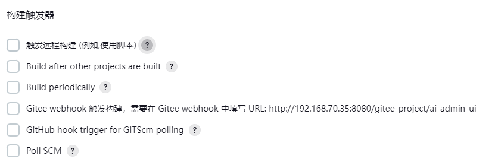
这里我简要介绍下各种触发方式的使用场景.

1. 触发远程构建（例如，使用脚本）： 这种方式允许通过远程API请求来触发构建。可以通过编写脚本或使用Jenkins提供的命令行工具来发起远程请求，从而启动构建。这为自动化流程提供了便利，允许在代码提交、测试完成或其他事件发生时自动触发构建。

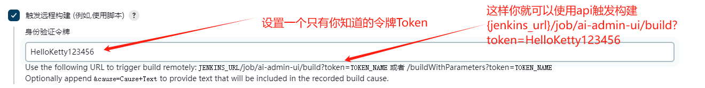

2. Build after other projects are built（在其他项目构建后构建）： 这个选项允许你设置一个项目在另一个项目成功构建之后自动触发。这在有项目依赖关系时非常有用，比如，只有当项目A构建成功后，项目B才需要开始构建。
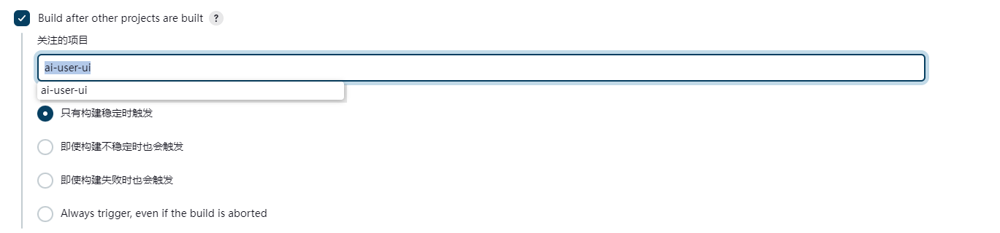

3. Build periodically（定时构建）： 通过设置一个类似于cron的表达式，Jenkins可以定期地执行构建任务。这适用于周期性任务，比如每晚进行构建和测试，确保代码库的稳定性。
以下是一些表达式例子
```bash
# 每十五分钟（可能在：07、：22、：37、：52）：
H/15 * * * *
# 每小时前半段每十分钟（三次，可能在：04、：14、：24）：
H(0-29)/10 * * * *
# 每两小时一次，时间为每小时后45分钟，从上午9:45开始，到每个工作日下午3:45结束：
45 9-16/2 * * 1-5
# 每个工作日上午8点至下午4点之间每两小时一次（可能是上午9:38、上午11:38、下午1:38、下午3:38）：
H H(8-15)/2 * * 1-5
# 除12月外，每月1日和15日每天一次：
H H 1,15 1-11 *
```

4. Gitee webhook 触发构建： 在 Gitee（类似于 GitHub 的中国版本）中设置 webhook，当特定的仓库事件发生时（如push、merge请求等），Gitee会向配置的URL发送HTTP请求。在这个例子中，URL是 http://192.168.70.35:8080/gitee-project/ai-admin-ui。Jenkins接收到请求后，会触发相关项目的构建。 -`我们主要演示这个`

5. GitHub hook trigger for GITScm polling（GitHub钩子触发GITScm轮询）： 当你在GitHub上配置了webhook，Jenkins可以监听这些webhook事件来触发构建。这通常用于当有代码push到仓库或者创建pull request时触发构建

6. Poll SCM（轮询源码管理）： 通过设置一个cron表达式，Jenkins定期检查源码管理系统中是否有更改（如新的提交）。如果有更改，Jenkins将触发构建。这种方式适用于那些不使用webhook的源码管理系统，或者当webhook不可用时的替代方案。与`定时构建`不同的点在于,无论源码管理系统上是否有提交变化,`定时构建`的构建任务都会触发,而`Poll SCM`还会判断源码是否发生变化,有发生变化了才会触发构建

这里我们演示下`当主分支pull request后,自动触发构建`

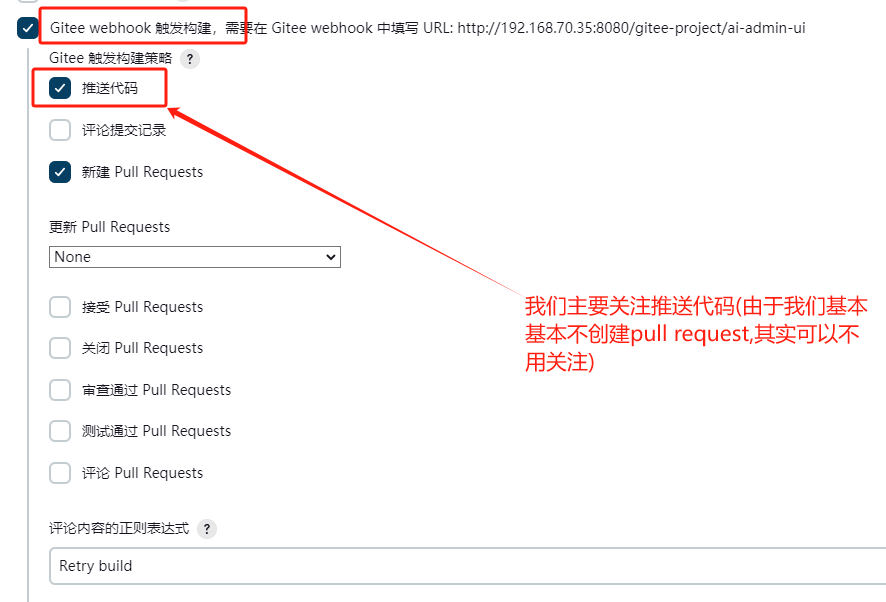

如果设置了此选项，则只能携带一致的 Token 的 WebHook 可以触发构建。

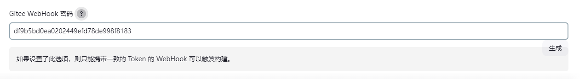

回调设置

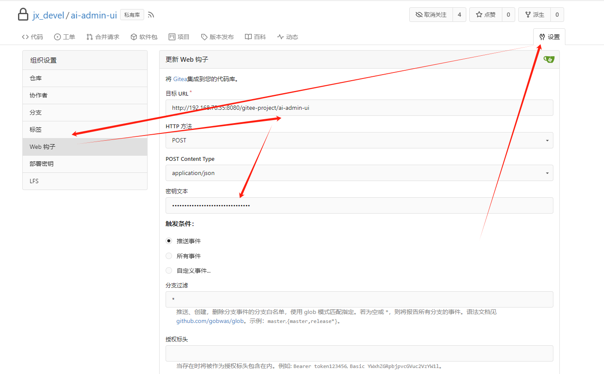


### 构建设置(以Vue项目为例)
由于我们是以`Vue`项目为例,这也是我们之前为什么需要安装NodeJs插件的原因.`Vue`项目有很多的依赖包是通过NodeJS的包管理器npm进行管理

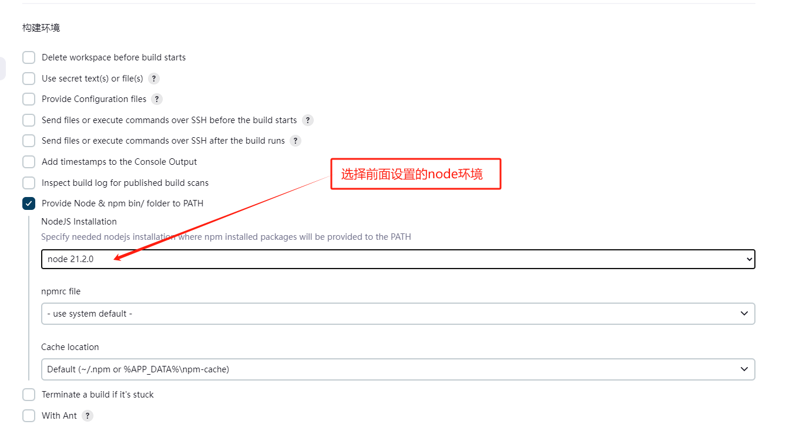

vue-cli项目打包指令(更新的项目现在已经基本转向vite了)
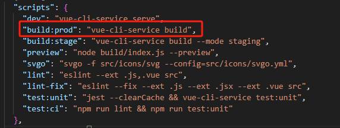

`Vue`项目发布时需要安装相关依赖,由于国内网络因素,我们使用了阿里云的npm镜像.其中`npm run build:prod`是我们执行设置的打包指令
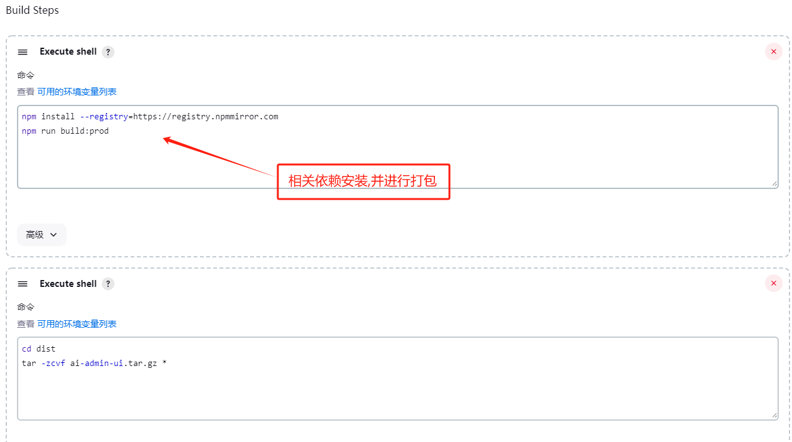

打包完成后,会在`dist`目录下输出构建后的文件,我们使用命令对其进行打包上传到远程服务器上
> cd dist&tar -zcvf ai-admin-ui.tar.gz * 该命令的作用进入dist目录并将当前目录下的文件打包成ai-admin-ui.tar.gz压缩包文件(方便后续上传)

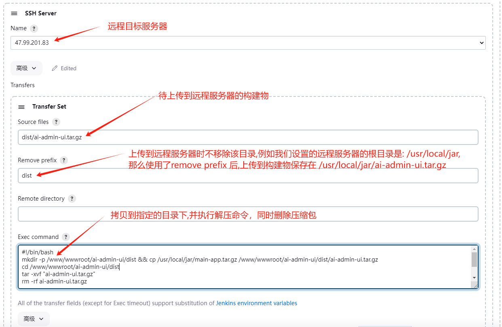

到此,我们的任务构建终于结束了.

> 前端项目一般需要有运行容器,例如Tomcat,nginx 或者直接使用docker进行镜像安装,我们以上的仅仅是将目标物自动构建并上传到远程服务器中的容器中.如果需要可视化的配置推荐使用宝塔

示例: nginx映射(非本篇重点,可忽略)
```bash
server {
    listen 9001;
    server_name _9001;

    # 前端页面的路径
    root /www/wwwroot/ai-admin-ui/dist;
    index index.php index.html index.htm default.php default.htm default.html;
}
```

### 遇到的一些问题

1. Webhook报错 webhook.ALLOWED_HOST_LIST setting
使用公司的gitea配置webhook报错

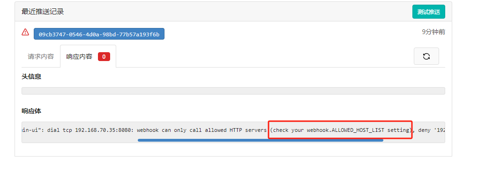
然后在[gitea社区问答](https://forum.gitea.com/t/webhook-webhook-allowed-host-list-setting/4655/3)中找到了这个答案
```bash
修改 /data/gitea/conf/app.ini 配置文件，确保存在如下配置

[webhook]
ALLOWED_HOST_LIST = xx.xx.xx.xx

重启服务就好了
```
> 这里的`xx.xx.xx.xx` 是`jenkins`所在的服务器IP,如果实在没法开放,那么就需要构建的时候上jenkins上手动点一下构建

### 参考链接
1. [Jenkins自动打包部署VUE项目](https://blog.csdn.net/qq_41085087/article/details/143161461)
2. [gitea社区问答-ALLOWED_HOST_LIST问题](https://forum.gitea.com/t/webhook-webhook-allowed-host-list-setting/4655/3)
