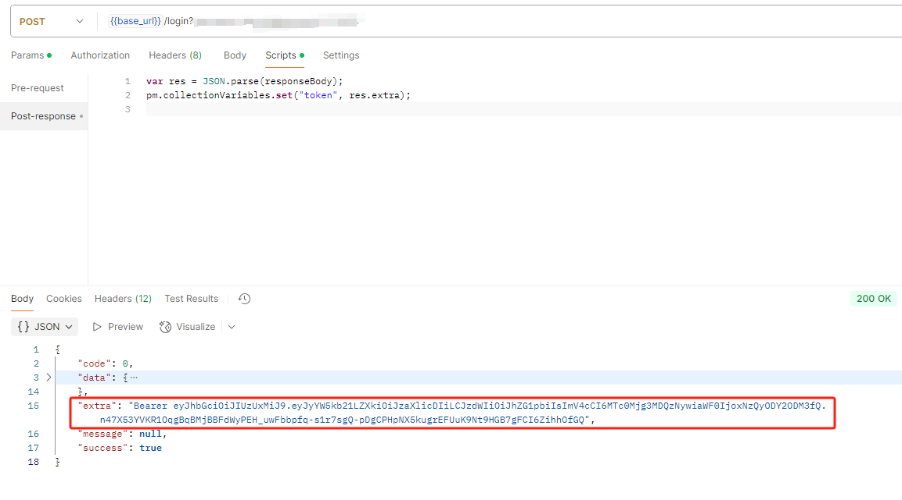

### 场景
由于前端调用受保护的接口时,需要携带token, 每次手动输入会比较繁琐。在使用postman进行接口测试时, 可以设置全局变量来简化这个过程。

### 步骤
这里我们的请求接口的返回值携带了Token下来,我们只需要在请求成功后, 把token保存到Collection变量中即可。



```
常见的Postman变量有 Global、Collection、Environment：
其中
Global：适用于所有场景的变量
Collection：只在当前Collection有效的变量
Environment：不同环境使用不同变量
```
我们只要在登录接口请求结束后调用脚本保存Token值, 然后在后续的请求中直接使用即可。切换到当前请求接口的Scripts标签,填入如下的脚本内容
```js
var res = JSON.parse(responseBody);
//这里因为我们的token是在extra字段中, 所以这里用的是res.extra
pm.collectionVariables.set("token", res.extra);
```
这里有个小插曲，postman在选择`Auth Type`为`Bearer Token`,会自动附带上`Bearer `,而我们后端返回的时候也加了`Bearer `, 所以这里我们还需要去掉`Bearer `, 否则会导致认证失败,因此我的脚本变成了厦门这样子
```js
var res = JSON.parse(responseBody);
var token = res.extra
token = token.replace(/^Bearer/, "").trim();
pm.collectionVariables.set("token", token);
```


点击左侧当前的Collection名，再点击Variables，可以看到设置的变量信息，说明变量设置成功


在Collection界面切换到`Authorization`标签,选择`Bearer Token`, 然后点击然后填入`{{token}}`(根据变量名的实际情况填写即可)


现在该Collection下所有的接口都可以继承Collection的认证token了，只需要在这些接口的Authorization页面选择认证Type为`Inherit auth from parent`，即继承自父项,但这步基本需要设置，因为默认就是`Inherit auth from parent`,除非你之前修改过了。

### 参考链接
1. [Postman设置统一认证token](https://blog.csdn.net/u011447403/article/details/123655201)